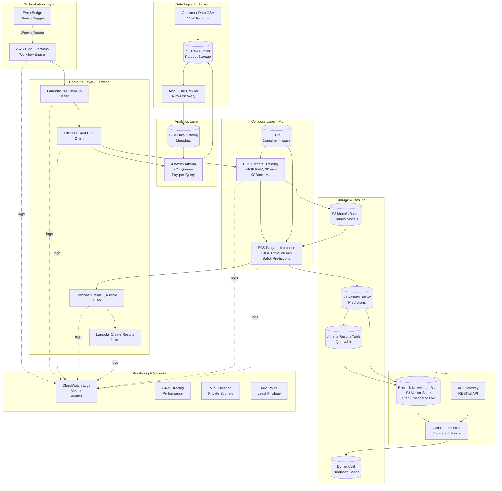

# Customer Engagement Prediction Platform

[](LICENSE)
[](https://www.python.org/downloads/)
[](https://github.com/psf/black)
[](https://github.com/PyCQA/bandit)

A serverless-first AWS proof-of-concept that demonstrates how to design and orchestrate an AI-driven engagement and prediction workflow using managed AWS services such as Lambda, Step Functions, Fargate, S3, and Athena.

This project was built and shared publicly as a learning and knowledge-sharing exercise for builders exploring scalable, cost-aware cloud architecture patterns on AWS.

## What is this?

A learning-focused proof-of-concept that demonstrates how to build an end-to-end ML pipeline for predicting customer engagement. This project is designed to run locally using LocalStack, allowing builders to explore AWS serverless architecture patterns end-to-end without requiring an AWS account or incurring cloud costs. The architecture and service choices intentionally map directly to real AWS deployments. It processes 100K synthetic customer records through a serverless pipeline to generate predictive insights.

**What it demonstrates:**
- Serverless orchestration patterns with Step Functions
- Containerized ML workloads with Fargate
- Serverless analytics with S3 + Athena
- AI-powered Q&A with Bedrock Knowledge Base
- Cost-aware architecture decisions

## Why This Project Exists

This repository was created as a public learning project to explore AWS serverless orchestration patterns and to share practical architecture decisions with other builders. It is not affiliated with any employer and is intentionally open for community learning, experimentation, and discussion.

**This repository helps other builders by:**
- Providing a complete, working example of serverless ML pipeline architecture
- Demonstrating real-world trade-offs (Lambda vs Fargate, S3+Athena vs databases, managed vs self-hosted)
- Enabling safe experimentation with LocalStack (no AWS account or costs required)
- Sharing lessons learned and common pitfalls to avoid
- Showing how to structure Terraform modules for serverless architectures

The goal is to demonstrate real-world trade-offs when building serverless ML pipelines on AWS, including when to use Lambda vs Fargate, how to structure data for Athena queries, and how to manage costs effectively.

## AWS Architecture Overview



**Core AWS Services**

- **Amazon API Gateway** — Request entry point for the application, handles authentication and rate limiting
- **AWS Lambda** — Stateless compute for orchestration and business logic, ideal for short-duration tasks
- **AWS Step Functions** — Workflow coordination, retries, and execution visibility for the ML pipeline
- **AWS Fargate** — Containerized execution for heavier model workloads that exceed Lambda limits
- **Amazon S3** — Durable storage for datasets, models, and outputs with lifecycle management
- **Amazon Athena** — Serverless analytics over data stored in S3, pay-per-query pricing model
- **AWS Glue** — Data catalog and schema discovery, enables SQL queries over S3 data
- **Amazon Bedrock** — AI model access for natural language Q&A over engagement data
- **Amazon DynamoDB** — Fast prediction caching to reduce redundant computations
- **Amazon CloudWatch** — Logging, metrics, and operational visibility across all services

## End-to-End Flow

1. **Data Ingestion** — Synthetic customer data (CSV) is uploaded to S3 and cataloged by Glue
2. **Orchestration** — Step Functions triggers the weekly ML pipeline via EventBridge schedule
3. **Data Preparation** — Lambda functions clean data and create train/test splits via Athena queries
4. **Model Training** — Fargate runs containerized XGBoost training job, saves models to S3
5. **Batch Inference** — Fargate loads trained models and generates predictions for all customers
6. **Results Storage** — Predictions are written to S3 and made queryable via Athena
7. **AI Q&A** — Bedrock Knowledge Base enables natural language queries over prediction results

## Key Design Decisions & Trade-offs

This section explains the architectural choices and their trade-offs:

- **Serverless-first approach** — Minimizes operational overhead and idle costs. Trade-off: Cold starts and execution time limits require careful design
- **Step Functions for orchestration** — Provides built-in retry logic, error handling, and execution visibility. Trade-off: Additional cost per state transition, but worth it for complex workflows
- **Fargate for ML workloads** — Used where compute duration (30+ minutes) or memory requirements (64GB) exceed Lambda limits. Trade-off: Higher cost than Lambda but necessary for large model training
- **S3 + Athena for analytics** — Avoids managing a database for a POC. Trade-off: Query performance depends on data partitioning and compression, but acceptable for batch analytics
- **Bedrock Knowledge Base with S3 vector store** — Simplifies AI integration without managing vector databases. Trade-off: Less flexible than self-hosted solutions, but reduces operational complexity
- **Emphasis on managed services** — Reduces undifferentiated heavy lifting (server management, scaling, patching). Trade-off: Less control over underlying infrastructure, but appropriate for learning projects

## Security and Cost Considerations

This project demonstrates security and cost-aware design patterns rather than audited compliance controls.

**Security patterns demonstrated:**
- Least-privilege IAM policies (with wildcard warnings documented for production)
- Avoiding hardcoded secrets (use environment variables / Secrets Manager)
- Centralized logging with CloudWatch
- VPC isolation for compute resources
- Encryption at rest and in transit

**Cost awareness:**
- Primary cost drivers: Fargate runtime (64GB RAM), Athena queries (data scanned), CloudWatch logs, Step Functions transitions
- Optimization strategies: Data partitioning for Athena, lifecycle policies for S3, log retention limits
- Budget safeguards: AWS Budgets configuration, CloudWatch cost alarms

**⚠️ Important:** Run this project in a sandbox AWS account and configure budgets before experimenting. See [Cost Safeguards](docs/deployment/cost_safeguards.md) for detailed guidance.

## Getting Started

This project is designed to run entirely locally using LocalStack, which provides a local AWS cloud stack that mirrors real AWS services. This allows you to experiment with serverless architecture patterns, understand service interactions, and learn AWS best practices—all without creating an AWS account or incurring any cloud costs.

**What you'll learn:**
- How to orchestrate ML pipelines with Step Functions
- When to choose Lambda vs Fargate for compute workloads
- How to structure data for cost-effective Athena queries
- How to integrate AI capabilities with Bedrock Knowledge Base
- How to design serverless architectures with Terraform

### Prerequisites

- Python 3.11+
- Docker & Docker Compose
- AWS CLI configured (for LocalStack)
- Terraform 1.5+ (optional, for infrastructure deployment)

### Quick Start (LocalStack)

```bash
# 1. Clone and setup
git clone https://github.com/tarverryan/poc-ai-app-predict-engage.git
cd poc-ai-app-predict-engage

# 2. Generate synthetic data (100K records)
python data/generate_platform_data.py

# 3. Start LocalStack (local AWS cloud stack)
docker-compose up -d

# 4. Deploy infrastructure to LocalStack
make deploy-local

# 5. Run ML pipeline
make run-pipeline
```

**Note:** LocalStack provides a local AWS environment that mirrors real AWS services. The architecture you'll see running locally maps directly to how it would run on real AWS—the only difference is you're not paying for it.

See [Developer Guide](docs/developer/DEVELOPER_GUIDE.md) for detailed setup instructions.

## Documentation

### Architecture & Design
- [Architecture Overview](docs/architecture.md) - System design and component responsibilities
- [Architecture Flow](docs/architecture/architecture_flow.md) - Detailed end-to-end data flow
- [Architecture Diagrams](docs/diagrams/) - Visual documentation (Mermaid diagrams)
- [Lessons Learned](docs/lessons-learned.md) - What worked, what didn't, and what to change next

### Development
- [Developer Guide](docs/developer/DEVELOPER_GUIDE.md) - Complete onboarding guide
- [Troubleshooting Guide](docs/guides/troubleshooting.md) - Common issues and solutions
- [SQL Queries](sql/) - Schema definitions and analytics queries

### Security & Operations
- [Security Documentation](docs/security/) - IAM policies, secrets management, required permissions
- [Cost Safeguards](docs/deployment/cost_safeguards.md) - Budget setup and cost optimization
- [Public Repo Checklist](docs/deployment/PUBLIC_REPO_CHECKLIST.md) - Pre-release verification

### Contributing
See [CONTRIBUTING.md](docs/governance/CONTRIBUTING.md), [CODE_OF_CONDUCT.md](docs/governance/CODE_OF_CONDUCT.md), and [SECURITY.md](docs/governance/SECURITY.md).

## Technology Stack

**Infrastructure:** Terraform, AWS (S3, Glue, Athena, Lambda, ECS Fargate, Bedrock, Step Functions, API Gateway, DynamoDB)  
**ML/Analytics:** Python 3.11+, XGBoost, Pandas, NumPy, Scikit-learn  
**Containers:** Docker, Amazon ECR  
**Local Development:** LocalStack, Docker Compose  
**CI/CD:** GitHub Actions with validation pipeline

## Project Status

**Status:** Learning-focused proof-of-concept  
**Built:** October 2025  
**Purpose:** Public AWS architecture exploration and knowledge sharing

## Important Disclaimer

⚠️ **This is a Proof-of-Concept (POC) / Learning Project**

- Security hardening, cost controls, and operational guardrails are **examples**, not production guarantees
- IAM policies may use wildcards for simplicity; **tighten for production**
- Run in a **sandbox AWS account** with budget alerts enabled
- This code is provided "as-is" for demonstration purposes
- All data is synthetic/mock data generated with Faker

## Author

Created and maintained by **Ryan Tarver**  
GitHub: [https://github.com/tarverryan](https://github.com/tarverryan)

This project is shared publicly for community learning and discussion.

## License

MIT License - see [LICENSE](LICENSE) for details.

## Contact

- **Issues:** [GitHub Issues](https://github.com/tarverryan/poc-ai-app-predict-engage/issues)
- **Security:** [Security Policy](docs/governance/SECURITY.md)
- **Discussions:** [GitHub Discussions](https://github.com/tarverryan/poc-ai-app-predict-engage/discussions)
