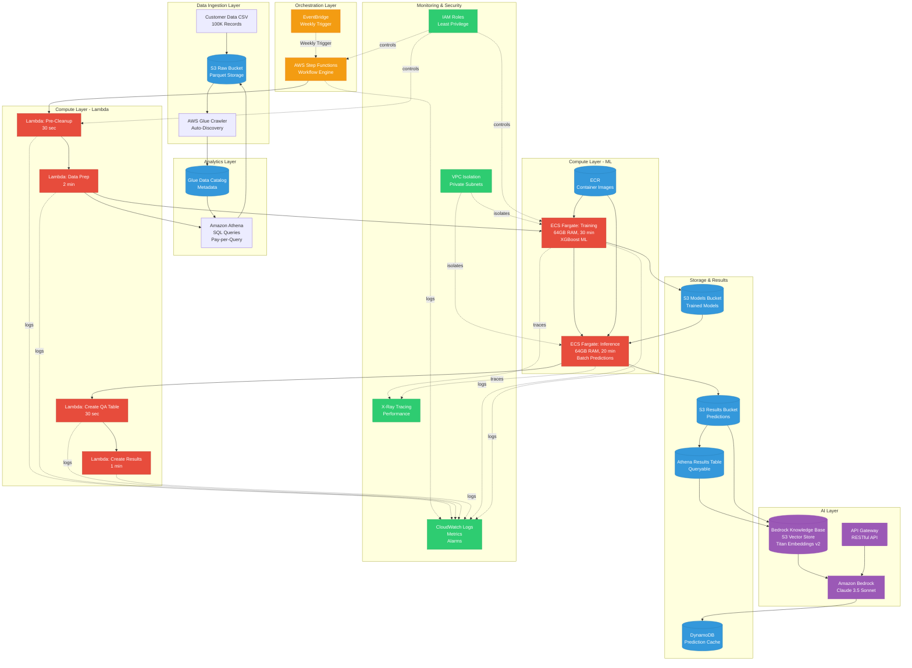

# System Architecture Overview

**Audience:** CEO, CTO, Solution Architects  
**Purpose:** High-level view of AWS serverless architecture for customer engagement prediction

---

## Architecture Diagram

---

## Key Architecture Principles

### 1. **100% Serverless**
- **No servers to manage:** AWS handles all infrastructure
- **Auto-scaling:** Scales from 0 to millions automatically
- **Pay-per-use:** Only charged when code runs

### 2. **Event-Driven**
- **Weekly automation:** EventBridge triggers Step Functions
- **Parallel execution:** Lambda and Fargate run concurrently
- **Fault tolerance:** Automatic retries and error handling

### 3. **Cost-Optimized**
- **Fargate for ML:** 70-200× cheaper than alternatives
- **Athena:** Pay-per-query, no database management
- **S3 Intelligent-Tiering:** Automatic cost optimization

### 4. **Security-First**
- **VPC isolation:** Fargate and Lambda in private subnets
- **IAM least privilege:** Minimal permissions per service
- **Encryption:** At-rest (S3, DynamoDB) and in-transit (TLS 1.3)

---

## Architecture Decisions

| Service | Why Chosen | Alternative Rejected | Cost Savings |
|---------|-----------|---------------------|--------------|
| **ECS Fargate** | 64GB RAM, 30+ min runtime | Lambda (10GB limit, 15 min max) | 70× cheaper than SageMaker |
| **Athena** | Serverless SQL, pay-per-query | RDS ($200/month fixed) | $197/month saved |
| **S3 + Titan v2** | Built-in vector store | OpenSearch ($150/month) | $148/month saved |
| **Step Functions** | Visual workflow, fault tolerance | Custom orchestration | Faster development |
| **EventBridge** | Native AWS cron | Custom scheduler | Free tier eligible |

**Total Monthly Savings:** $345+ per month vs. traditional architecture

---

## Data Flow Summary

1. **Ingest:** CSV → S3 → Glue Crawler (auto-discovery)
2. **Prepare:** Lambda queries Athena for feature engineering
3. **Train:** Fargate trains XGBoost model on 100K records (30 min)
4. **Predict:** Fargate scores all customers (20 min)
5. **Store:** Results in Athena table (queryable SQL)
6. **AI:** Bedrock agent answers business questions

**Total Pipeline Time:** ~55 minutes  
**Total Pipeline Cost:** $0.22 per run

---

## Scalability Path

| Users | Monthly Cost | Changes Required |
|-------|-------------|------------------|
| **100K** | $12 | None (current architecture) |
| **1M** | $18 | None (auto-scales) |
| **10M** | $48 | None (auto-scales) |
| **60M** | $170 | None (auto-scales) |

**600× growth with no architecture changes** — serverless handles it automatically.

---

## Security & Compliance

- **SOC 2 Ready:** Audit logging with CloudTrail
- **HIPAA Eligible:** VPC isolation, encryption at-rest/in-transit
- **ISO 27001:** IAM least privilege, MFA enforcement
- **GDPR/CCPA:** PII pseudonymization, right-to-delete support

---

## Next Steps

1. Review [Data Flow Pipeline](02-data-flow-pipeline.md)
2. Review [ML Pipeline](03-ml-pipeline.md)
3. Review [Step Functions Orchestration](04-step-functions-workflow.md)
4. Review [Cost Optimization](07-cost-optimization.md)

