# Data Flow Pipeline

**Audience:** Data Engineers, ML Engineers, Technical Leadership  
**Purpose:** Detailed data transformation flow from raw CSV to predictions

---

## End-to-End Data Flow

```mermaid
flowchart LR
    subgraph "Source Data"
        CSV[100K Customer Records<br/>72 Features<br/>CSV Format]
    end
    
    subgraph "S3 Raw Storage"
        S3_CSV[S3://raw/csv/<br/>Original CSV]
        S3_PARQ[S3://raw/parquet/<br/>Compressed Parquet<br/>9.4 MB]
    end
    
    subgraph "Data Catalog"
        CRAWLER[Glue Crawler<br/>Schema Discovery]
        CATALOG[(Glue Data Catalog<br/>Table Metadata)]
    end
    
    subgraph "Feature Engineering"
        ATHENA_QUERY[Athena SQL Queries<br/>Feature Selection<br/>Aggregations<br/>Joins]
        S3_FEATURES[S3://features/<br/>Training Dataset<br/>Test Dataset]
    end
    
    subgraph "ML Training"
        TRAIN_CONTAINER[Fargate Training Container<br/>Load Features<br/>Train XGBoost<br/>Validate Model]
        S3_MODEL[S3://models/<br/>model.pkl<br/>scaler.pkl<br/>metadata.json]
    end
    
    subgraph "ML Inference"
        INFER_CONTAINER[Fargate Inference Container<br/>Load Model<br/>Score All Customers<br/>Generate Predictions]
        S3_PRED[S3://results/<br/>predictions.parquet<br/>100K scored records]
    end
    
    subgraph "Results Storage"
        ATHENA_RESULTS[(Athena Results Table<br/>customer_id<br/>engagement_score_pred<br/>churn_probability<br/>ltv_estimate<br/>model_version)]
        DYNAMO_CACHE[(DynamoDB Cache<br/>Fast API Lookups<br/>TTL: 7 days)]
    end
    
    subgraph "AI Layer"
        BEDROCK_S3[S3://bedrock-kb/<br/>Context Documents<br/>Data Dictionary<br/>Schema]
        BEDROCK_KB[Bedrock Knowledge Base<br/>Titan Embeddings v2<br/>Vector Search]
        BEDROCK[Bedrock Agent<br/>Claude 3.5 Sonnet<br/>Q&A Engine]
    end
    
    %% Flow connections
    CSV -->|Upload| S3_CSV
    S3_CSV -->|Convert| S3_PARQ
    S3_PARQ -->|Discover| CRAWLER
    CRAWLER -->|Register| CATALOG
    CATALOG -->|Query| ATHENA_QUERY
    ATHENA_QUERY -->|Write| S3_FEATURES
    S3_FEATURES -->|Read| TRAIN_CONTAINER
    TRAIN_CONTAINER -->|Save| S3_MODEL
    S3_MODEL -->|Load| INFER_CONTAINER
    S3_FEATURES -->|Read| INFER_CONTAINER
    INFER_CONTAINER -->|Write| S3_PRED
    S3_PRED -->|Load| ATHENA_RESULTS
    ATHENA_RESULTS -->|Cache| DYNAMO_CACHE
    ATHENA_RESULTS -->|Context| BEDROCK_S3
    BEDROCK_S3 -->|Index| BEDROCK_KB
    BEDROCK_KB -->|Query| BEDROCK
    
    classDef source fill:#f9f9f9,stroke:#333,color:#333
    classDef storage fill:#3498db,stroke:#2980b9,color:#fff
    classDef compute fill:#e74c3c,stroke:#c0392b,color:#fff
    classDef ai fill:#9b59b6,stroke:#8e44ad,color:#fff
    classDef catalog fill:#f39c12,stroke:#e67e22,color:#fff
    
    class CSV source
    class S3_CSV,S3_PARQ,S3_FEATURES,S3_MODEL,S3_PRED,ATHENA_RESULTS,DYNAMO_CACHE,BEDROCK_S3 storage
    class TRAIN_CONTAINER,INFER_CONTAINER compute
    class BEDROCK_KB,BEDROCK ai
    class CRAWLER,CATALOG,ATHENA_QUERY catalog
```



---

## Data Transformation Stages

### Stage 1: Data Ingestion (1-time Setup)

**Input:** `platform_engagement_dataset.csv` (30.6 MB)  
**Process:**
1. Upload CSV to S3 raw bucket
2. AWS Glue Crawler scans and infers schema automatically
3. Registers table in Glue Data Catalog
4. Convert CSV to Parquet (3.3× compression)

**Output:** `platform_engagement_dataset.parquet` (9.4 MB)  
**Cost:** $0.00 (Glue Crawler free tier)  
**Time:** 2-3 minutes

---

### Stage 2: Feature Engineering (Weekly, Automated)

```sql
-- Example Athena SQL for feature engineering
-- Executed by Lambda: data_prep

CREATE TABLE features_train AS
SELECT 
    customer_id,
    
    -- Engagement features
    sessions_last_7_days,
    feed_time_minutes_day,
    app_opens_day,
    
    -- Social media features
    stories_viewed_day,
    reels_watched_day,
    posts_last_30_days,
    avg_likes_per_post,
    
    -- Dating features
    matches_per_day,
    messages_sent_day,
    dates_completed_month,
    
    -- Derived features
    ROUND(messages_sent_day / NULLIF(matches_per_day, 0), 2) AS msg_per_match_ratio,
    CASE 
        WHEN tenure_months < 3 THEN 'New'
        WHEN tenure_months < 12 THEN 'Growing'
        WHEN tenure_months < 24 THEN 'Established'
        ELSE 'Veteran'
    END AS tenure_segment,
    
    -- Target variable (for training)
    engagement_score,
    churn_30_day
    
FROM customers
WHERE partition_date = CURRENT_DATE
  AND engagement_score IS NOT NULL  -- Filter nulls
  AND sessions_last_7_days >= 0      -- Data quality check
LIMIT 80000;  -- 80% training split
```

**Output:** S3://features/train/ + S3://features/test/  
**Cost:** $0.01 per query (Athena pay-per-scan)  
**Time:** 30-60 seconds

---

### Stage 3: ML Training (Weekly, Automated)

**Input:** S3://features/train/ (80K records)  
**Process:**
1. **Load data:** Read Parquet from S3
2. **Preprocess:** Scale numerical features, encode categorical
3. **Train model:** XGBoost regression (engagement_score)
4. **Validate:** Calculate R², RMSE on test set
5. **Fairness check:** Ensure no demographic bias
6. **Save artifacts:** Model, scaler, metadata to S3

**Output:**
- `model.pkl` (XGBoost trained model)
- `scaler.pkl` (StandardScaler for features)
- `metadata.json` (training metrics, feature names, timestamp)

**Cost:** $1.18 per run (Fargate 64GB, 30 min)  
**Time:** 30 minutes

**Training Metrics:**
- R² Score: 0.82 (82% variance explained)
- RMSE: 0.09 (prediction error)
- MAE: 0.07 (mean absolute error)

---

### Stage 4: ML Inference (Weekly, Automated)

**Input:** 
- S3://models/model.pkl
- S3://features/test/ (20K records)

**Process:**
1. **Load model:** Unpickle trained model from S3
2. **Load data:** Read all customers needing scores
3. **Predict:** Batch predictions (1,000 records/second)
4. **Post-process:** Round scores, add confidence intervals
5. **Save results:** Write predictions to S3 as Parquet

**Output:** S3://results/predictions.parquet

```
customer_id | engagement_score_pred | confidence | model_version | scored_at
------------|----------------------|------------|---------------|------------------
uuid-1234   | 0.72                 | 0.89       | v1.2.0        | 2025-10-21 03:45
uuid-5678   | 0.34                 | 0.76       | v1.2.0        | 2025-10-21 03:45
...
```

**Cost:** $0.79 per run (Fargate 64GB, 20 min)  
**Time:** 20 minutes  
**Throughput:** 5,000 predictions/minute

---

### Stage 5: Results Publishing (Weekly, Automated)

**Input:** S3://results/predictions.parquet  
**Process:**
1. **Create Athena external table** pointing to S3
2. **Join predictions with original features**
3. **Create final results table:**

```sql
-- Executed by Lambda: create_results_table

CREATE TABLE customer_engagement_predictions AS
SELECT 
    c.*,                              -- All original features
    p.engagement_score_pred,          -- Predicted engagement
    p.churn_probability,              -- Predicted churn risk
    p.ltv_estimate,                   -- Predicted lifetime value
    p.confidence,                     -- Model confidence (0-1)
    p.model_version,                  -- Which model version
    p.scored_at,                      -- Timestamp
    
    -- Risk categorization
    CASE 
        WHEN p.churn_probability > 0.7 THEN 'Critical'
        WHEN p.churn_probability > 0.5 THEN 'High'
        WHEN p.churn_probability > 0.3 THEN 'Medium'
        ELSE 'Low'
    END AS churn_risk_tier
    
FROM customers c
JOIN predictions p ON c.customer_id = p.customer_id
WHERE p.scored_at = (SELECT MAX(scored_at) FROM predictions);
```

**Output:** Athena table queryable by SQL  
**Cost:** $0.00 (table creation is free)  
**Time:** 30 seconds

---

### Stage 6: AI Knowledge Base (Weekly, Updated)

**Input:** 
- Athena results table metadata
- Data dictionary
- Schema documentation

**Process:**
1. Generate context documents (markdown)
2. Upload to S3://bedrock-kb/
3. Bedrock indexes with Titan Embeddings v2
4. Claude agent can now answer questions

**Example Questions Answered:**
- "What are the top 3 drivers of engagement?"
- "How many customers are at high churn risk?"
- "What's the average LTV of users in the 'Very High' engagement tier?"

**Cost:** $0.05 per run (Bedrock embeddings)  
**Time:** 2 minutes

---

## Data Quality Checks

### Automated Validations

```python
# Executed during training and inference

def validate_data_quality(df):
    """
    Ensure data meets quality standards before ML processing
    """
    checks = {
        'null_check': df.isnull().sum().sum() == 0,
        'range_check': (df['engagement_score'] >= 0).all() and (df['engagement_score'] <= 1).all(),
        'duplicate_check': df['customer_id'].is_unique,
        'row_count': len(df) >= 1000,  # Minimum sample size
        'feature_count': len(df.columns) >= 20  # Expected features
    }
    
    if not all(checks.values()):
        raise ValueError(f"Data quality checks failed: {checks}")
    
    return True
```

**Checks performed:**
- ✅ No null values in critical fields
- ✅ Engagement scores in 0-1 range
- ✅ No duplicate customer IDs
- ✅ Minimum sample size met
- ✅ All expected features present

---

## Data Lineage

```
platform_engagement_dataset.csv (Source)
    ↓
S3://raw/platform_engagement_dataset.parquet (Storage)
    ↓
Glue Data Catalog: customers table (Catalog)
    ↓
Athena: features_train & features_test (Engineering)
    ↓
Fargate Training: model.pkl (Training)
    ↓
Fargate Inference: predictions.parquet (Scoring)
    ↓
Athena: customer_engagement_predictions (Results)
    ↓
DynamoDB: prediction_cache (Cache)
    ↓
Bedrock: AI Q&A (Insights)
```

**Full lineage tracked in:**
- CloudWatch Logs
- S3 versioning
- Model metadata.json

---

## Performance Metrics

| Stage | Input Size | Output Size | Time | Cost |
|-------|-----------|-------------|------|------|
| **Ingestion** | 30.6 MB CSV | 9.4 MB Parquet | 3 min | $0.00 |
| **Feature Eng** | 9.4 MB | 2.1 MB | 1 min | $0.01 |
| **Training** | 2.1 MB | 1.2 MB model | 30 min | $1.18 |
| **Inference** | 9.4 MB + 1.2 MB | 0.8 MB predictions | 20 min | $0.79 |
| **Publishing** | 0.8 MB | Athena table | 30 sec | $0.00 |
| **KB Update** | Athena metadata | Vector index | 2 min | $0.05 |
| **TOTAL** | 30.6 MB | Complete pipeline | 55 min | **$2.03** |

**Weekly operation cost:** $2.03  
**Monthly cost (4 runs):** $8.12  
**Annual cost (52 runs):** $105.56

---

## Scalability Analysis

| Customers | Data Size | Training Time | Inference Time | Weekly Cost |
|-----------|-----------|---------------|----------------|-------------|
| **100K** | 9.4 MB | 30 min | 20 min | $2.03 |
| **1M** | 94 MB | 45 min | 30 min | $3.15 |
| **10M** | 940 MB | 90 min | 60 min | $6.30 |
| **60M** | 5.6 GB | 180 min | 120 min | $12.60 |

**Key insight:** 600× customer growth = 6× cost increase (sub-linear scaling)

---

## Next Steps

1. Review [ML Pipeline Details](03-ml-pipeline.md)
2. Review [Step Functions Orchestration](04-step-functions-workflow.md)
3. Review [Security Architecture](05-security-architecture.md)

