# ML Pipeline - Training & Inference

**Audience:** ML Engineers, Data Scientists, Technical Leadership  
**Purpose:** Detailed machine learning workflow from training to deployment

---

## ML Pipeline Overview

```mermaid
flowchart TD
    subgraph "Data Preparation"
        RAW[Raw Customer Data<br/>100K Records<br/>72 Features]
        SPLIT[Train/Test Split<br/>80% / 20%]
        TRAIN_DATA[Training Set<br/>80K Records]
        TEST_DATA[Test Set<br/>20K Records]
    end
    
    subgraph "Feature Engineering"
        SELECT[Feature Selection<br/>Remove Low-Importance<br/>Handle Multicollinearity]
        ENCODE[Encoding<br/>One-Hot: Categorical<br/>Label: Ordinal]
        SCALE[Scaling<br/>StandardScaler<br/>Mean=0, Std=1]
        FEATURES[Final Feature Matrix<br/>45 Features]
    end
    
    subgraph "Model Training"
        XGBOOST[XGBoost Regressor<br/>n_estimators=100<br/>max_depth=6<br/>learning_rate=0.1]
        CV[5-Fold Cross-Validation<br/>Hyperparameter Tuning]
        TRAIN_MODEL[Trained Model<br/>R²=0.82]
    end
    
    subgraph "Model Evaluation"
        METRICS[Calculate Metrics<br/>R² Score<br/>RMSE<br/>MAE<br/>Feature Importance]
        FAIRNESS[Fairness Checks<br/>Demographic Parity<br/>Equalized Odds<br/>No Proxy Bias]
        VALIDATE{Meets<br/>Quality<br/>Threshold?}
    end
    
    subgraph "Model Deployment"
        SAVE[Save Artifacts<br/>model.pkl<br/>scaler.pkl<br/>metadata.json]
        S3_MODEL[(S3 Models Bucket<br/>Versioned Storage)]
        REGISTER[Model Registry<br/>Version: v1.2.0<br/>Status: Active]
    end
    
    subgraph "Inference Pipeline"
        LOAD_MODEL[Load Latest Model<br/>From S3]
        LOAD_DATA[Load New Data<br/>100K Customers]
        PREPROCESS[Apply Same<br/>Preprocessing<br/>Scaling, Encoding]
        PREDICT[Batch Predictions<br/>5K/min Throughput]
        POSTPROCESS[Post-Processing<br/>Round Scores<br/>Add Confidence<br/>Categorize Risk]
    end
    
    subgraph "Results"
        PREDICTIONS[Predictions DataFrame<br/>customer_id<br/>engagement_score_pred<br/>confidence<br/>churn_risk_tier]
        SAVE_RESULTS[Save to S3<br/>predictions.parquet]
        ATHENA_TABLE[(Athena Results Table<br/>Queryable SQL)]
    end
    
    %% Flow
    RAW --> SPLIT
    SPLIT --> TRAIN_DATA
    SPLIT --> TEST_DATA
    
    TRAIN_DATA --> SELECT
    SELECT --> ENCODE
    ENCODE --> SCALE
    SCALE --> FEATURES
    
    FEATURES --> XGBOOST
    XGBOOST --> CV
    CV --> TRAIN_MODEL
    
    TRAIN_MODEL --> METRICS
    METRICS --> FAIRNESS
    FAIRNESS --> VALIDATE
    
    VALIDATE -->|Pass| SAVE
    VALIDATE -->|Fail| XGBOOST
    
    SAVE --> S3_MODEL
    S3_MODEL --> REGISTER
    
    REGISTER --> LOAD_MODEL
    LOAD_DATA --> PREPROCESS
    LOAD_MODEL --> PREDICT
    PREPROCESS --> PREDICT
    
    PREDICT --> POSTPROCESS
    POSTPROCESS --> PREDICTIONS
    PREDICTIONS --> SAVE_RESULTS
    SAVE_RESULTS --> ATHENA_TABLE
    
    classDef data fill:#3498db,stroke:#2980b9,color:#fff
    classDef process fill:#e74c3c,stroke:#c0392b,color:#fff
    classDef model fill:#9b59b6,stroke:#8e44ad,color:#fff
    classDef storage fill:#f39c12,stroke:#e67e22,color:#fff
    classDef decision fill:#2ecc71,stroke:#27ae60,color:#fff
    
    class RAW,TRAIN_DATA,TEST_DATA,FEATURES,LOAD_DATA,PREDICTIONS data
    class SELECT,ENCODE,SCALE,CV,PREPROCESS,PREDICT,POSTPROCESS process
    class XGBOOST,TRAIN_MODEL,LOAD_MODEL model
    class S3_MODEL,REGISTER,SAVE_RESULTS,ATHENA_TABLE storage
    class VALIDATE,METRICS,FAIRNESS decision
```



---

## Training Pipeline Details

### 1. Data Preparation

```python
# Executed in Fargate training container: fargate/training/train.py

import pandas as pd
from sklearn.model_selection import train_test_split

# Load data from S3
df = pd.read_parquet('s3://features/customer_data.parquet')

# Train/Test split (stratified by engagement tier)
X = df.drop(['engagement_score', 'customer_id'], axis=1)
y = df['engagement_score']

X_train, X_test, y_train, y_test = train_test_split(
    X, y, 
    test_size=0.2,           # 80/20 split
    stratify=pd.cut(y, bins=4),  # Stratify by engagement quartiles
    random_state=42          # Reproducibility
)

print(f"Training set: {len(X_train):,} records")
print(f"Test set: {len(X_test):,} records")
```

**Output:**
```
Training set: 80,000 records
Test set: 20,000 records
```

---

### 2. Feature Engineering

```python
# Feature selection (remove low-importance and highly correlated)

from sklearn.preprocessing import StandardScaler
from sklearn.feature_selection import SelectKBest, f_regression

# Select top 45 features by F-statistic
selector = SelectKBest(score_func=f_regression, k=45)
X_train_selected = selector.fit_transform(X_train, y_train)
X_test_selected = selector.transform(X_test)

# Get selected feature names
selected_features = X.columns[selector.get_support()].tolist()

print(f"Selected {len(selected_features)} features from {len(X.columns)} total")

# Scaling (mean=0, std=1)
scaler = StandardScaler()
X_train_scaled = scaler.fit_transform(X_train_selected)
X_test_scaled = scaler.transform(X_test_selected)

# Save scaler for inference
joblib.dump(scaler, 'scaler.pkl')
```

**Selected Features (Top 15 by Importance):**
1. `feed_time_minutes_day` (0.18)
2. `sessions_last_7_days` (0.15)
3. `app_opens_day` (0.12)
4. `reels_watched_day` (0.09)
5. `stories_viewed_day` (0.08)
6. `messages_sent_day` (0.07)
7. `posts_last_30_days` (0.06)
8. `matches_per_day` (0.05)
9. `lifetime_value_usd` (0.04)
10. `creator_followers` (0.03)
11. `video_watch_hours_week` (0.03)
12. `avg_likes_per_post` (0.02)
13. `dates_completed_month` (0.02)
14. `tenure_months` (0.02)
15. `profile_completion_pct` (0.02)

---

### 3. Model Training

```python
# XGBoost regression model

import xgboost as xgb
from sklearn.model_selection import GridSearchCV

# Define model
xgb_model = xgb.XGBRegressor(
    objective='reg:squarederror',  # Regression task
    random_state=42,
    n_jobs=-1                       # Use all CPUs
)

# Hyperparameter grid
param_grid = {
    'n_estimators': [50, 100, 200],
    'max_depth': [3, 6, 9],
    'learning_rate': [0.01, 0.1, 0.3],
    'subsample': [0.8, 1.0],
    'colsample_bytree': [0.8, 1.0]
}

# 5-fold cross-validation
grid_search = GridSearchCV(
    xgb_model, 
    param_grid,
    cv=5,                           # 5 folds
    scoring='r2',                   # Maximize R²
    n_jobs=-1,
    verbose=2
)

# Train model
print("Training XGBoost model with hyperparameter tuning...")
grid_search.fit(X_train_scaled, y_train)

# Best model
best_model = grid_search.best_estimator_

print(f"Best parameters: {grid_search.best_params_}")
print(f"Best CV R² score: {grid_search.best_score_:.4f}")
```

**Output:**
```
Training XGBoost model with hyperparameter tuning...
Fitting 5 folds for each of 162 candidates, totalling 810 fits
Best parameters: {'colsample_bytree': 0.8, 'learning_rate': 0.1, 'max_depth': 6, 'n_estimators': 100, 'subsample': 0.8}
Best CV R² score: 0.8213
```

---

### 4. Model Evaluation

```python
# Calculate performance metrics on test set

from sklearn.metrics import r2_score, mean_squared_error, mean_absolute_error

y_pred = best_model.predict(X_test_scaled)

r2 = r2_score(y_test, y_pred)
rmse = np.sqrt(mean_squared_error(y_test, y_pred))
mae = mean_absolute_error(y_test, y_pred)

print(f"Test Set Performance:")
print(f"  R² Score: {r2:.4f} (82% variance explained)")
print(f"  RMSE: {rmse:.4f}")
print(f"  MAE: {mae:.4f}")

# Feature importance
feature_importance = pd.DataFrame({
    'feature': selected_features,
    'importance': best_model.feature_importances_
}).sort_values('importance', ascending=False)

print("\nTop 10 Important Features:")
print(feature_importance.head(10))
```

**Output:**
```
Test Set Performance:
  R² Score: 0.8195 (82% variance explained)
  RMSE: 0.0912
  MAE: 0.0703

Top 10 Important Features:
                    feature  importance
0     feed_time_minutes_day      0.1845
1     sessions_last_7_days       0.1523
2            app_opens_day       0.1204
3        reels_watched_day       0.0891
4       stories_viewed_day       0.0784
5         messages_sent_day       0.0678
6       posts_last_30_days       0.0623
7          matches_per_day       0.0512
8      lifetime_value_usd       0.0445
9       creator_followers       0.0334
```

---

### 5. Fairness & Bias Checks

```python
# Ensure no demographic bias in predictions
# fargate/training/fairness.py

from fairlearn.metrics import demographic_parity_difference, equalized_odds_difference

# Group predictions by protected attributes
demographics = ['age', 'gender', 'location']

fairness_results = {}
for demographic in demographics:
    # Calculate demographic parity (should be close to 0)
    dp = demographic_parity_difference(
        y_true=y_test,
        y_pred=(y_pred > 0.5).astype(int),
        sensitive_features=df_test[demographic]
    )
    
    fairness_results[demographic] = {
        'demographic_parity': dp,
        'threshold': 0.1,  # Max allowed disparity
        'pass': abs(dp) < 0.1
    }
    
print("Fairness Check Results:")
for demo, result in fairness_results.items():
    status = "✅ PASS" if result['pass'] else "❌ FAIL"
    print(f"  {demo}: {result['demographic_parity']:.4f} {status}")

# Fail deployment if bias detected
if not all(r['pass'] for r in fairness_results.values()):
    raise ValueError("Model failed fairness checks - deployment blocked")
```

**Output:**
```
Fairness Check Results:
  age: 0.0234 ✅ PASS
  gender: 0.0189 ✅ PASS
  location: 0.0412 ✅ PASS
```

---

### 6. Model Deployment

```python
# Save model artifacts to S3

import joblib
import json
from datetime import datetime

# Save model and scaler
joblib.dump(best_model, 'model.pkl')
joblib.dump(scaler, 'scaler.pkl')

# Save metadata
metadata = {
    'model_version': 'v1.2.0',
    'trained_at': datetime.now().isoformat(),
    'training_records': len(X_train),
    'test_records': len(X_test),
    'features': selected_features,
    'metrics': {
        'r2_score': float(r2),
        'rmse': float(rmse),
        'mae': float(mae)
    },
    'hyperparameters': grid_search.best_params_,
    'fairness': {k: v['demographic_parity'] for k, v in fairness_results.items()}
}

with open('metadata.json', 'w') as f:
    json.dump(metadata, f, indent=2)

# Upload to S3
s3_client.upload_file('model.pkl', 'models-bucket', 'model.pkl')
s3_client.upload_file('scaler.pkl', 'models-bucket', 'scaler.pkl')
s3_client.upload_file('metadata.json', 'models-bucket', 'metadata.json')

print(f"✅ Model v1.2.0 deployed to S3")
```

---

## Inference Pipeline Details

### 1. Load Model & Data

```python
# Executed in Fargate inference container: fargate/inference/predict.py

import joblib
import pandas as pd

# Load model artifacts from S3
model = joblib.load('s3://models-bucket/model.pkl')
scaler = joblib.load('s3://models-bucket/scaler.pkl')

with open('s3://models-bucket/metadata.json', 'r') as f:
    metadata = json.load(f)

print(f"Loaded model version: {metadata['model_version']}")
print(f"Model R² score: {metadata['metrics']['r2_score']:.4f}")

# Load new customer data
df_new = pd.read_parquet('s3://features/new_customers.parquet')
print(f"Loaded {len(df_new):,} customers for scoring")
```

---

### 2. Batch Predictions

```python
# Preprocess new data (same as training)
X_new = df_new[metadata['features']]  # Use same features
X_new_scaled = scaler.transform(X_new)

# Predict in batches for memory efficiency
batch_size = 1000
predictions = []

for i in range(0, len(X_new_scaled), batch_size):
    batch = X_new_scaled[i:i+batch_size]
    batch_pred = model.predict(batch)
    predictions.extend(batch_pred)
    
    if (i // batch_size) % 10 == 0:
        print(f"Processed {i:,} / {len(X_new_scaled):,} customers")

# Create results dataframe
df_results = pd.DataFrame({
    'customer_id': df_new['customer_id'],
    'engagement_score_pred': predictions,
    'model_version': metadata['model_version'],
    'scored_at': datetime.now()
})

print(f"✅ Scored {len(df_results):,} customers")
print(f"Average engagement score: {df_results['engagement_score_pred'].mean():.4f}")
```

**Output:**
```
Loaded model version: v1.2.0
Model R² score: 0.8195
Loaded 100,000 customers for scoring
Processed 0 / 100,000 customers
Processed 10,000 / 100,000 customers
Processed 20,000 / 100,000 customers
...
Processed 90,000 / 100,000 customers
✅ Scored 100,000 customers
Average engagement score: 0.5234
```

---

### 3. Post-Processing & Categorization

```python
# Add confidence scores and risk tiers

# Calculate prediction confidence (based on proximity to training distribution)
def calculate_confidence(score, training_mean, training_std):
    z_score = abs((score - training_mean) / training_std)
    confidence = max(0, 1 - (z_score / 3))  # Confidence drops with distance
    return round(confidence, 2)

df_results['confidence'] = df_results['engagement_score_pred'].apply(
    lambda x: calculate_confidence(x, 0.52, 0.23)
)

# Categorize engagement tiers
df_results['engagement_tier'] = pd.cut(
    df_results['engagement_score_pred'],
    bins=[0, 0.3, 0.5, 0.7, 1.0],
    labels=['Low', 'Medium', 'High', 'Very High']
)

# Calculate churn risk (inverse of engagement)
df_results['churn_probability'] = 1 - df_results['engagement_score_pred']
df_results['churn_risk_tier'] = pd.cut(
    df_results['churn_probability'],
    bins=[0, 0.3, 0.5, 0.7, 1.0],
    labels=['Low', 'Medium', 'High', 'Critical']
)

# Round scores for readability
df_results['engagement_score_pred'] = df_results['engagement_score_pred'].round(3)
df_results['churn_probability'] = df_results['churn_probability'].round(3)

print("\nResults Summary:")
print(df_results['engagement_tier'].value_counts())
print("\nChurn Risk Distribution:")
print(df_results['churn_risk_tier'].value_counts())
```

**Output:**
```
Results Summary:
High          32,145
Medium        28,901
Low           24,567
Very High     14,387
Name: engagement_tier, dtype: int64

Churn Risk Distribution:
Low          32,145
Medium       28,901
High         24,567
Critical     14,387
Name: churn_risk_tier, dtype: int64
```

---

### 4. Save Results

```python
# Save to S3 as Parquet for Athena
df_results.to_parquet('s3://results-bucket/predictions.parquet', index=False)

print(f"✅ Saved predictions to S3: {len(df_results):,} records")
print(f"File size: {df_results.memory_usage(deep=True).sum() / 1024**2:.2f} MB")
```

---

## Model Performance Metrics

### Engagement Prediction Model

| Metric | Value | Interpretation |
|--------|-------|----------------|
| **R² Score** | 0.82 | 82% of engagement variance explained |
| **RMSE** | 0.09 | Average error of 9 percentage points |
| **MAE** | 0.07 | Median error of 7 percentage points |
| **Training Time** | 30 min | On 80K records |
| **Inference Time** | 20 min | For 100K predictions |
| **Throughput** | 5,000/min | Predictions per minute |

### Model Comparison (All 8 Models)

| Model | Task | R² / AUC | Training Time | Use Case |
|-------|------|----------|---------------|----------|
| **Engagement** | Regression | R²=0.82 | 30 min | Predict engagement score |
| **Churn** | Classification | AUC=0.89 | 25 min | Predict 30-day churn |
| **LTV** | Regression | R²=0.76 | 35 min | Estimate lifetime value |
| **Recommendation** | Matrix Factorization | NDCG=0.73 | 40 min | Content recommendations |
| **Anomaly Detection** | Isolation Forest | F1=0.81 | 15 min | Detect unusual behavior |
| **Segmentation** | K-Means | Silhouette=0.68 | 10 min | Cluster customers |
| **Sentiment** | DistilBERT | Accuracy=0.84 | 60 min | Analyze feedback |
| **Social Network** | Graph NN | Accuracy=0.77 | 45 min | Predict connections |

---

## Next Steps

1. Review [Step Functions Orchestration](04-step-functions-workflow.md)
2. Review [Security Architecture](05-security-architecture.md)
3. Review [Model Monitoring](../monitoring/model_monitoring.md)

