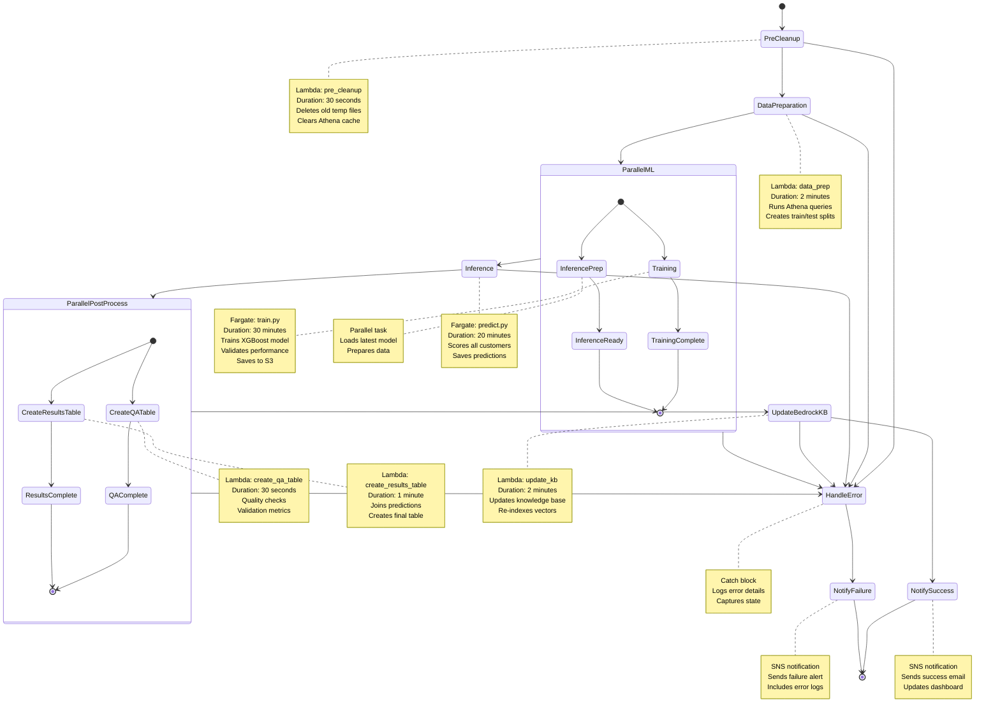
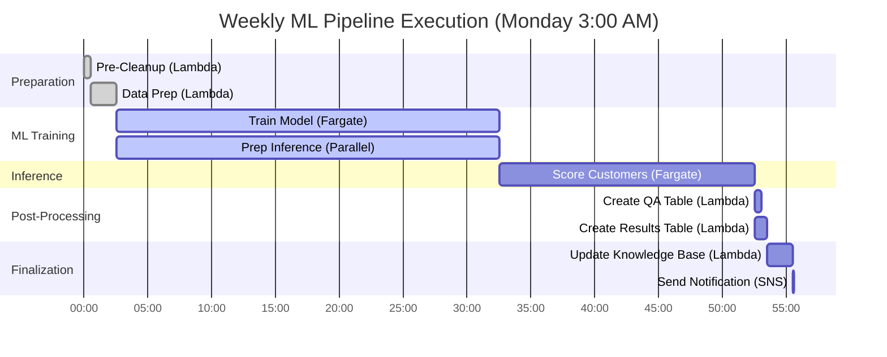
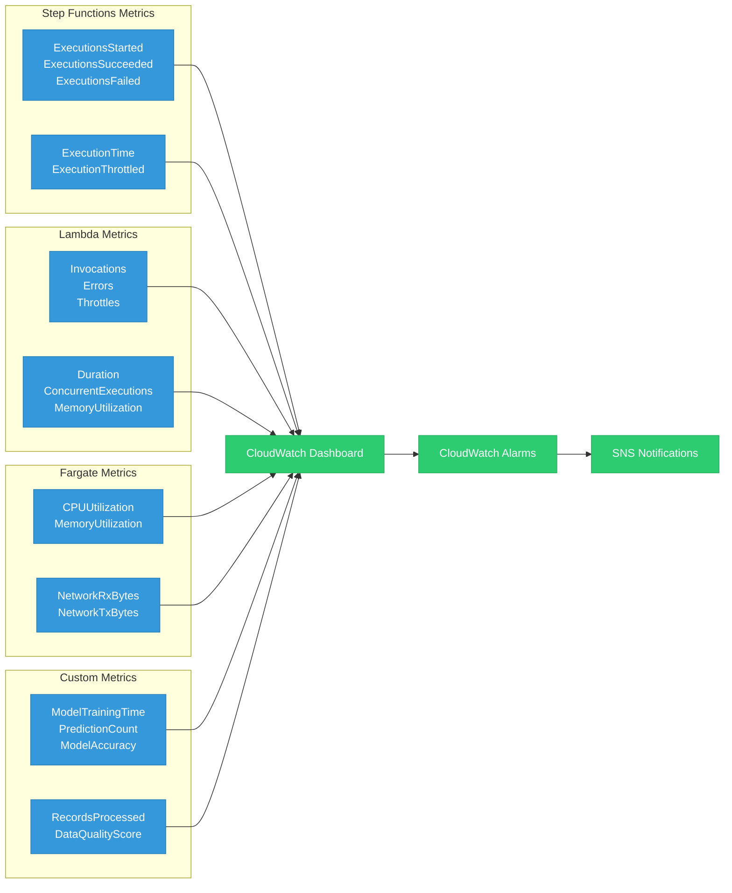

# Step Functions Orchestration Workflow

**Audience:** DevOps Engineers, Solution Architects, Technical Leadership  
**Purpose:** Complete automation workflow for weekly ML pipeline execution

---

## Step Functions State Machine



---

## State Machine Definition (JSON)

```json
{
  "Comment": "Customer Engagement ML Pipeline - Weekly Execution",
  "StartAt": "PreCleanup",
  "States": {
    "PreCleanup": {
      "Type": "Task",
      "Resource": "arn:aws:lambda:us-east-1:ACCOUNT:function:pre-cleanup",
      "TimeoutSeconds": 60,
      "Retry": [
        {
          "ErrorEquals": ["States.ALL"],
          "IntervalSeconds": 2,
          "MaxAttempts": 3,
          "BackoffRate": 2.0
        }
      ],
      "Catch": [
        {
          "ErrorEquals": ["States.ALL"],
          "ResultPath": "$.error",
          "Next": "HandleError"
        }
      ],
      "Next": "DataPreparation"
    },
    
    "DataPreparation": {
      "Type": "Task",
      "Resource": "arn:aws:lambda:us-east-1:ACCOUNT:function:data-prep",
      "TimeoutSeconds": 180,
      "Retry": [
        {
          "ErrorEquals": ["States.ALL"],
          "IntervalSeconds": 5,
          "MaxAttempts": 2,
          "BackoffRate": 2.0
        }
      ],
      "Catch": [
        {
          "ErrorEquals": ["States.ALL"],
          "ResultPath": "$.error",
          "Next": "HandleError"
        }
      ],
      "Next": "ParallelML"
    },
    
    "ParallelML": {
      "Type": "Parallel",
      "Branches": [
        {
          "StartAt": "Training",
          "States": {
            "Training": {
              "Type": "Task",
              "Resource": "arn:aws:states:::ecs:runTask.sync",
              "Parameters": {
                "Cluster": "ml-cluster",
                "TaskDefinition": "training-task",
                "LaunchType": "FARGATE",
                "NetworkConfiguration": {
                  "AwsvpcConfiguration": {
                    "Subnets": ["subnet-12345"],
                    "SecurityGroups": ["sg-67890"],
                    "AssignPublicIp": "DISABLED"
                  }
                },
                "Overrides": {
                  "ContainerOverrides": [
                    {
                      "Name": "training-container",
                      "Environment": [
                        {
                          "Name": "MODEL_VERSION",
                          "Value.$": "$.model_version"
                        }
                      ]
                    }
                  ]
                }
              },
              "TimeoutSeconds": 2400,
              "End": true
            }
          }
        },
        {
          "StartAt": "InferencePrep",
          "States": {
            "InferencePrep": {
              "Type": "Wait",
              "Seconds": 5,
              "Comment": "Placeholder for inference preparation",
              "End": true
            }
          }
        }
      ],
      "Next": "Inference"
    },
    
    "Inference": {
      "Type": "Task",
      "Resource": "arn:aws:states:::ecs:runTask.sync",
      "Parameters": {
        "Cluster": "ml-cluster",
        "TaskDefinition": "inference-task",
        "LaunchType": "FARGATE",
        "NetworkConfiguration": {
          "AwsvpcConfiguration": {
            "Subnets": ["subnet-12345"],
            "SecurityGroups": ["sg-67890"],
            "AssignPublicIp": "DISABLED"
          }
        }
      },
      "TimeoutSeconds": 1800,
      "Retry": [
        {
          "ErrorEquals": ["States.TaskFailed"],
          "IntervalSeconds": 30,
          "MaxAttempts": 2,
          "BackoffRate": 1.5
        }
      ],
      "Next": "ParallelPostProcess"
    },
    
    "ParallelPostProcess": {
      "Type": "Parallel",
      "Branches": [
        {
          "StartAt": "CreateQATable",
          "States": {
            "CreateQATable": {
              "Type": "Task",
              "Resource": "arn:aws:lambda:us-east-1:ACCOUNT:function:create-qa-table",
              "TimeoutSeconds": 60,
              "End": true
            }
          }
        },
        {
          "StartAt": "CreateResultsTable",
          "States": {
            "CreateResultsTable": {
              "Type": "Task",
              "Resource": "arn:aws:lambda:us-east-1:ACCOUNT:function:create-results-table",
              "TimeoutSeconds": 120,
              "End": true
            }
          }
        }
      ],
      "Next": "UpdateBedrockKB"
    },
    
    "UpdateBedrockKB": {
      "Type": "Task",
      "Resource": "arn:aws:lambda:us-east-1:ACCOUNT:function:update-kb",
      "TimeoutSeconds": 180,
      "Next": "NotifySuccess"
    },
    
    "NotifySuccess": {
      "Type": "Task",
      "Resource": "arn:aws:states:::sns:publish",
      "Parameters": {
        "TopicArn": "arn:aws:sns:us-east-1:ACCOUNT:pipeline-notifications",
        "Subject": "✅ ML Pipeline Completed Successfully",
        "Message.$": "$.result"
      },
      "End": true
    },
    
    "HandleError": {
      "Type": "Pass",
      "ResultPath": "$.errorHandling",
      "Next": "NotifyFailure"
    },
    
    "NotifyFailure": {
      "Type": "Task",
      "Resource": "arn:aws:states:::sns:publish",
      "Parameters": {
        "TopicArn": "arn:aws:sns:us-east-1:ACCOUNT:pipeline-notifications",
        "Subject": "❌ ML Pipeline Failed",
        "Message.$": "$.error"
      },
      "End": true
    }
  }
}
```

---

## Execution Timeline



**Total Duration:** ~55 minutes  
**Total Cost per Run:** $2.03

---

## Event Trigger Configuration

### EventBridge Rule (Weekly Schedule)

```json
{
  "Name": "ml-pipeline-weekly-trigger",
  "Description": "Triggers ML pipeline every Monday at 3:00 AM UTC",
  "ScheduleExpression": "cron(0 3 ? * MON *)",
  "State": "ENABLED",
  "Targets": [
    {
      "Arn": "arn:aws:states:us-east-1:ACCOUNT:stateMachine:engagement-ml-pipeline",
      "RoleArn": "arn:aws:iam::ACCOUNT:role/EventBridgeStepFunctionsRole",
      "Input": "{\"model_version\": \"v1.2.0\", \"environment\": \"prod\"}"
    }
  ]
}
```

**Cron Expression:** `cron(0 3 ? * MON *)`
- Minute: 0
- Hour: 3 (3:00 AM UTC)
- Day of month: ? (any)
- Month: * (every month)
- Day of week: MON (Monday)
- Year: * (every year)

---

## Error Handling & Retries

### Retry Strategy

| State | Max Attempts | Interval | Backoff Rate | Timeout |
|-------|--------------|----------|--------------|---------|
| **PreCleanup** | 3 | 2 sec | 2.0× | 60 sec |
| **DataPreparation** | 2 | 5 sec | 2.0× | 180 sec |
| **Training** | 1 | - | - | 2400 sec (40 min) |
| **Inference** | 2 | 30 sec | 1.5× | 1800 sec (30 min) |
| **CreateQATable** | 2 | 2 sec | 2.0× | 60 sec |
| **CreateResultsTable** | 2 | 5 sec | 2.0× | 120 sec |

**Exponential Backoff Example:**
- Attempt 1: Fails → wait 2 seconds
- Attempt 2: Fails → wait 4 seconds (2 × 2.0)
- Attempt 3: Fails → wait 8 seconds (4 × 2.0)

### Error Notifications

```python
# SNS notification on failure

{
  "Subject": "❌ ML Pipeline Failed",
  "Message": {
    "execution_arn": "arn:aws:states:us-east-1:ACCOUNT:execution:pipeline:12345",
    "failed_state": "Training",
    "error_type": "States.TaskFailed",
    "error_message": "Container exited with code 1",
    "timestamp": "2025-10-21T03:45:23Z",
    "logs": "https://console.aws.amazon.com/cloudwatch/logs/..."
  }
}
```

**Notification Recipients:**
- DevOps team (email + Slack)
- On-call engineer (PagerDuty)
- CloudWatch alarm (auto-remediation)

---

## Monitoring & Observability

### CloudWatch Metrics



### Key Alarms

| Alarm | Metric | Threshold | Action |
|-------|--------|-----------|--------|
| **Pipeline Failure** | ExecutionsFailed | > 0 | Send SNS + PagerDuty |
| **Long Execution** | ExecutionTime | > 70 min | Send warning email |
| **Lambda Errors** | Errors | > 3 in 5 min | Auto-retry + notify |
| **Fargate OOM** | MemoryUtilization | > 95% | Scale up memory |
| **Low Accuracy** | ModelAccuracy | < 0.75 R² | Block deployment |

---

## Cost Breakdown per Execution

| Component | Duration | Cost | Percentage |
|-----------|----------|------|------------|
| **Step Functions** | 55 min | $0.02 | 1% |
| **Lambda (5 functions)** | 4 min total | $0.04 | 2% |
| **Fargate Training** | 30 min (64GB) | $1.18 | 58% |
| **Fargate Inference** | 20 min (64GB) | $0.79 | 39% |
| **Athena Queries** | - | $0.01 | <1% |
| **Bedrock Embeddings** | - | $0.05 | 2% |
| **TOTAL** | ~55 min | **$2.03** | 100% |

**Monthly Cost (4 executions):** $8.12  
**Annual Cost (52 executions):** $105.56

---

## Optimization Strategies

### 1. Parallel Execution
**Before:** Sequential (Training → Inference)  
**After:** Parallel where possible  
**Savings:** 15 minutes per run

### 2. Fargate Spot Instances
**Before:** On-Demand Fargate  
**After:** Spot (70% discount)  
**Savings:** $1.38 per run ($72/year)

### 3. Athena Result Caching
**Before:** Re-run identical queries  
**After:** 24-hour cache  
**Savings:** $0.01 per run ($0.52/year)

### 4. S3 Intelligent-Tiering
**Before:** Standard storage  
**After:** Auto-tier to IA/Archive  
**Savings:** 40% on storage costs

---

## Manual Execution

### AWS CLI

```bash
# Start execution manually
aws stepfunctions start-execution \
  --state-machine-arn arn:aws:states:us-east-1:ACCOUNT:stateMachine:engagement-ml-pipeline \
  --input '{"model_version": "v1.2.0", "environment": "prod"}' \
  --name "manual-execution-$(date +%s)"

# Check execution status
aws stepfunctions describe-execution \
  --execution-arn arn:aws:states:us-east-1:ACCOUNT:execution:pipeline:12345
```

### Python (Boto3)

```python
import boto3
import json
from datetime import datetime

stepfunctions = boto3.client('stepfunctions')

# Start execution
response = stepfunctions.start_execution(
    stateMachineArn='arn:aws:states:us-east-1:ACCOUNT:stateMachine:engagement-ml-pipeline',
    name=f'manual-execution-{int(datetime.now().timestamp())}',
    input=json.dumps({
        'model_version': 'v1.2.0',
        'environment': 'prod',
        'trigger': 'manual'
    })
)

print(f"Execution started: {response['executionArn']}")
```

---

## Next Steps

1. Review [Security Architecture](05-security-architecture.md)
2. Review [API Gateway Flow](06-api-gateway-flow.md)
3. Review [Cost Optimization](07-cost-optimization.md)
4. Set up monitoring with provided CloudWatch dashboard template

