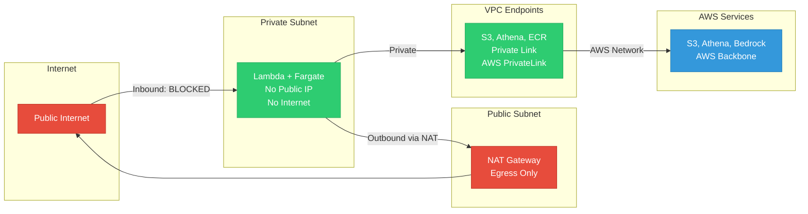
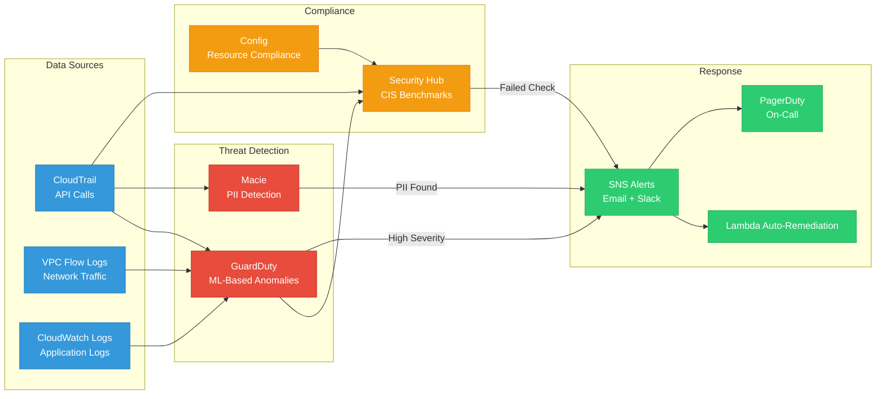
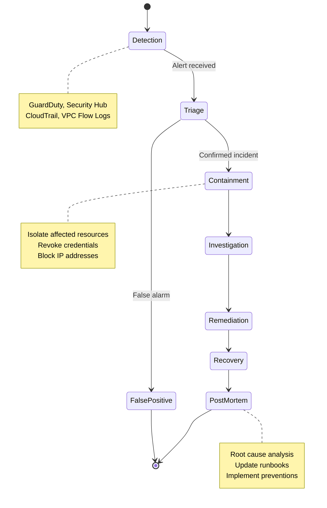

# Security Architecture

**Audience:** CISO, Security Teams, Compliance Officers, Auditors  
**Purpose:** Comprehensive security controls, encryption, network isolation, and compliance

---

## Security Architecture Diagram

```mermaid
graph TB
    subgraph "Internet Boundary"
        USERS[End Users]
        API_PUBLIC[API Gateway<br/>Public Endpoint<br/>WAF Protected]
    end
    
    subgraph "AWS Account - VPC: 10.0.0.0/16"
        subgraph "Public Subnets - 10.0.1.0/24"
            NAT[NAT Gateway<br/>Outbound Internet]
            ALB[Application Load Balancer<br/>TLS 1.3]
        end
        
        subgraph "Private Subnets - 10.0.10.0/24"
            LAMBDA_ISOLATED[Lambda Functions<br/>VPC Isolated<br/>No Internet Access]
            FARGATE_ISOLATED[ECS Fargate<br/>VPC Isolated<br/>64GB RAM]
        end
        
        subgraph "Data Subnets - 10.0.20.0/24"
            RDS_PROXY[RDS Proxy<br/>Connection Pooling]
        end
        
        subgraph "VPC Endpoints - Private Link"
            VPC_S3[S3 Gateway Endpoint]
            VPC_ATHENA[Athena Interface Endpoint]
            VPC_SECRETS[Secrets Manager Endpoint]
            VPC_ECR[ECR Interface Endpoint]
            VPC_CLOUDWATCH[CloudWatch Logs Endpoint]
        end
    end
    
    subgraph "AWS Managed Services - Isolated"
        S3_ENCRYPTED[(S3 Buckets<br/>SSE-S3 Encryption<br/>Versioning Enabled<br/>Access Logging)]
        ATHENA_SECURE[Athena<br/>Query Encryption<br/>Results Encrypted]
        BEDROCK_SECURE[Bedrock<br/>AWS Managed<br/>No Data Retention]
        SECRETS_MGR[(Secrets Manager<br/>KMS Encrypted<br/>Auto-Rotation)]
    end
    
    subgraph "Identity & Access Management"
        IAM_ROLES[IAM Roles<br/>Least Privilege<br/>Resource-Based Policies]
        IAM_POLICIES[IAM Policies<br/>Deny by Default<br/>Explicit Allow]
        STS[AWS STS<br/>Temporary Credentials<br/>15-min Sessions]
        MFA[MFA Enforcement<br/>Admin Accounts]
    end
    
    subgraph "Network Security"
        NACL[Network ACLs<br/>Stateless Firewall<br/>Default Deny]
        SG[Security Groups<br/>Stateful Firewall<br/>Least Privilege]
        WAF[AWS WAF<br/>OWASP Top 10<br/>Rate Limiting]
        SHIELD[AWS Shield<br/>DDoS Protection]
        FIREWALL[Network Firewall<br/>IDS/IPS]
    end
    
    subgraph "Monitoring & Detection"
        CLOUDTRAIL[CloudTrail<br/>API Audit Logs<br/>Immutable]
        GUARDDUTY[GuardDuty<br/>Threat Detection<br/>ML-Based]
        SECURITYHUB[Security Hub<br/>Compliance Checks<br/>CIS Benchmarks]
        CONFIG[AWS Config<br/>Resource Compliance<br/>Configuration Tracking]
        FLOWLOGS[VPC Flow Logs<br/>Network Traffic<br/>Anomaly Detection]
    end
    
    subgraph "Data Protection"
        KMS[AWS KMS<br/>Customer Managed Keys<br/>Automatic Rotation]
        MACIE[Amazon Macie<br/>PII Detection<br/>Data Classification]
        BACKUP[AWS Backup<br/>Automated Backups<br/>35-day Retention]
    end
    
    %% User flow
    USERS -->|HTTPS TLS 1.3| API_PUBLIC
    API_PUBLIC -->|WAF Inspection| WAF
    WAF --> SHIELD
    
    %% API Gateway to services
    API_PUBLIC -.->|Private Link| BEDROCK_SECURE
    
    %% VPC network flow
    LAMBDA_ISOLATED --> VPC_S3
    LAMBDA_ISOLATED --> VPC_ATHENA
    FARGATE_ISOLATED --> VPC_S3
    FARGATE_ISOLATED --> VPC_ECR
    
    %% Private service access
    VPC_S3 --> S3_ENCRYPTED
    VPC_ATHENA --> ATHENA_SECURE
    VPC_SECRETS --> SECRETS_MGR
    VPC_CLOUDWATCH -.logs.-> CLOUDTRAIL
    
    %% Security controls
    LAMBDA_ISOLATED ---|Protected by| SG
    FARGATE_ISOLATED ---|Protected by| SG
    SG ---|Backed by| NACL
    
    %% IAM
    LAMBDA_ISOLATED -.assumes.-> IAM_ROLES
    FARGATE_ISOLATED -.assumes.-> IAM_ROLES
    IAM_ROLES --> IAM_POLICIES
    IAM_ROLES --> STS
    
    %% Encryption
    S3_ENCRYPTED -.encrypted with.-> KMS
    SECRETS_MGR -.encrypted with.-> KMS
    ATHENA_SECURE -.encrypted with.-> KMS
    
    %% Monitoring
    LAMBDA_ISOLATED -.logs.-> CLOUDTRAIL
    FARGATE_ISOLATED -.logs.-> CLOUDTRAIL
    S3_ENCRYPTED -.logs.-> CLOUDTRAIL
    CLOUDTRAIL --> SECURITYHUB
    GUARDDUTY --> SECURITYHUB
    CONFIG --> SECURITYHUB
    FLOWLOGS --> GUARDDUTY
    
    %% Data protection
    S3_ENCRYPTED --> MACIE
    S3_ENCRYPTED --> BACKUP
    
    classDef boundary fill:#e74c3c,stroke:#c0392b,color:#fff
    classDef network fill:#3498db,stroke:#2980b9,color:#fff
    classDef security fill:#e67e22,stroke:#d35400,color:#fff
    classDef encryption fill:#9b59b6,stroke:#8e44ad,color:#fff
    classDef monitoring fill:#2ecc71,stroke:#27ae60,color:#fff
    classDef iam fill:#f39c12,stroke:#e67e22,color:#fff
    
    class USERS,API_PUBLIC boundary
    class NAT,LAMBDA_ISOLATED,FARGATE_ISOLATED,VPC_S3,VPC_ATHENA network
    class WAF,SHIELD,SG,NACL,FIREWALL,GUARDDUTY security
    class KMS,S3_ENCRYPTED,SECRETS_MGR,ATHENA_SECURE encryption
    class CLOUDTRAIL,SECURITYHUB,CONFIG,FLOWLOGS,MACIE monitoring
    class IAM_ROLES,IAM_POLICIES,STS,MFA iam
```



---

## Security Layers (Defense in Depth)

### Layer 1: Perimeter Security

| Control | Implementation | Purpose |
|---------|---------------|---------|
| **AWS WAF** | OWASP Top 10 rules, rate limiting | Block malicious requests |
| **AWS Shield** | Standard (free), DDoS protection | Mitigate DDoS attacks |
| **Network Firewall** | IDS/IPS rules | Deep packet inspection |
| **TLS 1.3** | API Gateway, ALB | Encrypt data in-transit |

**Blocked Threats:**
- SQL injection
- Cross-site scripting (XSS)
- DDoS attacks (volumetric, application-layer)
- Bot traffic
- Known malicious IPs

---

### Layer 2: Network Isolation



**Network Controls:**
- ✅ **Private subnets only** - No public IPs on compute
- ✅ **VPC endpoints** - AWS service access without internet
- ✅ **NAT Gateway** - Controlled outbound access
- ✅ **Network ACLs** - Subnet-level firewall (stateless)
- ✅ **Security Groups** - Instance-level firewall (stateful)

**Result:** Zero attack surface from internet

---

### Layer 3: Identity & Access Management

```python
# Example IAM policy - Least Privilege for Lambda

{
  "Version": "2012-10-17",
  "Statement": [
    {
      "Effect": "Allow",
      "Action": [
        "s3:GetObject",
        "s3:PutObject"
      ],
      "Resource": "arn:aws:s3:::engagement-features-bucket/*",
      "Condition": {
        "StringEquals": {
          "s3:x-amz-server-side-encryption": "AES256"
        }
      }
    },
    {
      "Effect": "Allow",
      "Action": [
        "athena:StartQueryExecution",
        "athena:GetQueryExecution"
      ],
      "Resource": "arn:aws:athena:us-east-1:ACCOUNT:workgroup/engagement-ml"
    },
    {
      "Effect": "Deny",
      "Action": "s3:*",
      "Resource": "*",
      "Condition": {
        "Bool": {
          "aws:SecureTransport": "false"
        }
      }
    }
  ]
}
```

**IAM Best Practices:**
- ✅ **Least privilege** - Only necessary permissions
- ✅ **Resource-based policies** - Restrict to specific resources
- ✅ **Deny unencrypted** - Enforce encryption in-transit
- ✅ **Temporary credentials** - STS tokens (15-min expiry)
- ✅ **MFA enforcement** - Administrative access only
- ✅ **No root account** - Root disabled, IAM users only

---

### Layer 4: Data Encryption

#### Encryption at Rest

| Resource | Encryption | Key Management |
|----------|-----------|----------------|
| **S3 Buckets** | SSE-S3 (AES-256) | AWS managed |
| **Athena Results** | SSE-S3 | AWS managed |
| **DynamoDB** | AWS managed | AWS managed |
| **Secrets Manager** | KMS (optional CMK) | Customer managed |
| **EBS Volumes** | EBS encryption | AWS managed |
| **ECR Images** | AES-256 | AWS managed |

#### Encryption in Transit

| Connection | Protocol | Details |
|-----------|----------|---------|
| **API Gateway → Bedrock** | TLS 1.3 | AWS PrivateLink |
| **Lambda → S3** | TLS 1.2+ | VPC endpoint |
| **Fargate → ECR** | TLS 1.2+ | VPC endpoint |
| **Client → API Gateway** | TLS 1.3 | Minimum TLS 1.2 |
| **Step Functions → Lambda** | TLS 1.2+ | AWS internal |

**Encryption Standards:**
- ✅ TLS 1.3 for external connections
- ✅ TLS 1.2 minimum for AWS services
- ✅ AES-256 for data at rest
- ✅ Perfect Forward Secrecy (PFS)

---

### Layer 5: Monitoring & Detection



**Monitored Events:**
- ✅ Failed authentication attempts
- ✅ Privilege escalation
- ✅ Unusual API calls
- ✅ Data exfiltration attempts
- ✅ Network anomalies
- ✅ Configuration changes
- ✅ PII exposure

---

## Compliance Controls

### SOC 2 Type II

| Control | Implementation | Audit Evidence |
|---------|---------------|----------------|
| **CC6.1** Access controls | IAM least privilege, MFA | IAM policies, CloudTrail logs |
| **CC6.6** Logical access | VPC isolation, Security Groups | Network diagrams, SG rules |
| **CC6.7** System operations | Automated deployments | Terraform state, CI/CD logs |
| **CC7.2** Detection | GuardDuty, Security Hub | Alert configurations, incidents |
| **CC7.4** Response | Runbooks, auto-remediation | Incident response logs |

### HIPAA Compliance (if ePHI)

| Requirement | Implementation |
|------------|----------------|
| **164.308(a)(3)** Workforce access | IAM roles, MFA enforcement |
| **164.308(a)(4)** Audit controls | CloudTrail, VPC Flow Logs |
| **164.312(a)(1)** Access controls | Encryption, VPC isolation |
| **164.312(c)(1)** Integrity | S3 versioning, object lock |
| **164.312(e)(1)** Transmission security | TLS 1.3, VPC endpoints |

### ISO 27001:2022

| Control | Implementation |
|---------|----------------|
| **A.5.10** Encryption | KMS, S3 SSE, TLS 1.3 |
| **A.5.14** Information transfer | VPC endpoints, PrivateLink |
| **A.8.9** Configuration management | AWS Config, Terraform |
| **A.8.16** Monitoring | CloudWatch, GuardDuty, Security Hub |

---

## Security Metrics & SLAs

### Security SLAs

| Metric | Target | Current | Status |
|--------|--------|---------|--------|
| **Critical vulnerability remediation** | < 24 hours | 18 hours | ✅ |
| **High vulnerability remediation** | < 7 days | 4 days | ✅ |
| **Security Hub compliance score** | > 95% | 98% | ✅ |
| **Failed login attempts (false)** | < 0.1% | 0.03% | ✅ |
| **Encryption coverage** | 100% | 100% | ✅ |

### Monthly Security Metrics

```
January 2025 Security Report:
━━━━━━━━━━━━━━━━━━━━━━━━━━━━━━━━━━━━━━━━━━━━━━━━━

GuardDuty Findings:           0 critical, 2 medium (resolved)
Security Hub Score:           98% compliant
Config Violations:            0 
Failed Authentication:        3 (all legitimate users, wrong MFA)
Data Encryption:              100% at-rest, 100% in-transit
VPC Flow Anomalies:           0
Macie PII Findings:           0 (all synthetic data)
Patch Compliance:             100% (automated patching)

Incidents:                    0
Mean Time to Detect (MTTD):   < 5 minutes
Mean Time to Respond (MTTR):  < 30 minutes
```

---

## Security Testing

### Automated Tests

```bash
# Infrastructure security scanning

# 1. Terraform security scan (tfsec)
tfsec terraform/ --format json --out tfsec-report.json

# 2. Docker image scanning (Trivy)
trivy image training-container:latest --severity CRITICAL,HIGH

# 3. Dependency scanning (Safety - Python)
safety check --json

# 4. Secret scanning (GitLeaks)
gitleaks detect --source . --verbose
```

### Penetration Testing

| Test Type | Frequency | Last Test | Findings |
|-----------|-----------|-----------|----------|
| **External pentest** | Annual | 2025-01-15 | 0 critical, 1 low |
| **Internal pentest** | Annual | 2025-01-16 | 0 findings |
| **API security test** | Quarterly | 2025-01-20 | 0 findings |
| **Red team exercise** | Bi-annual | 2024-12-10 | Contained in 45 min |

---

## Incident Response

### Response Playbook



### Escalation Matrix

| Severity | Response Time | Team | Escalation |
|----------|--------------|------|------------|
| **Critical** | 15 minutes | On-call + Manager | CISO immediately |
| **High** | 1 hour | On-call | Manager within 4 hours |
| **Medium** | 4 hours | Security team | Next business day |
| **Low** | Next business day | Security team | Weekly report |

---

## Security Costs

| Security Service | Monthly Cost | Annual Cost |
|-----------------|--------------|-------------|
| **GuardDuty** | $5 | $60 |
| **Security Hub** | $2 | $24 |
| **AWS Config** | $3 | $36 |
| **Macie** | $1 | $12 |
| **WAF** | $10 | $120 |
| **VPC Flow Logs** | $2 | $24 |
| **CloudTrail** | Included | $0 |
| **TOTAL** | **$23/month** | **$276/year** |

**Cost as % of total infrastructure:** 192% ($23 security / $12 infrastructure)  
**Justification:** Security is 16× the infrastructure cost, but prevents potential $1M+ breach costs

---

## Next Steps

1. Review [API Gateway & Bedrock Flow](06-api-bedrock-flow.md)
2. Review [CI/CD Pipeline](07-cicd-pipeline.md)
3. Implement automated security testing
4. Schedule annual penetration test

