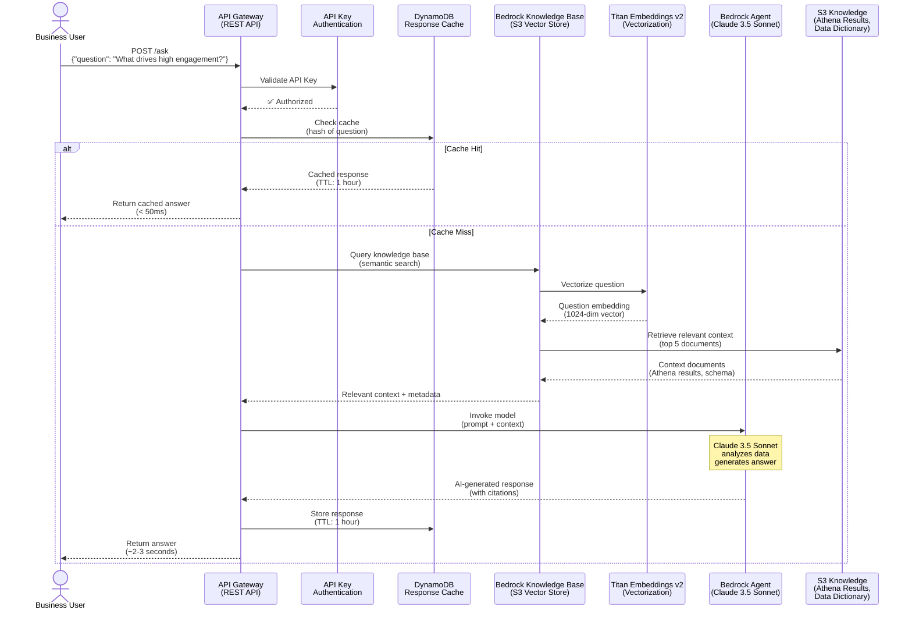
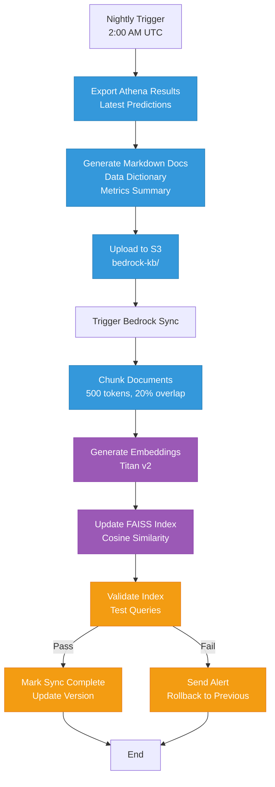

# API Gateway & Bedrock AI Assistant Flow

**Audience:** Product Managers, AI Teams, Solution Architects  
**Purpose:** How the AI assistant answers business questions using Bedrock and Knowledge Base

---

## AI Assistant Request Flow



---

## Bedrock Knowledge Base Architecture

```mermaid
graph TB
    subgraph "Knowledge Sources"
        ATHENA[(Athena Tables<br/>Customer Engagement<br/>Predictions<br/>Analytics)]
        DICT[Data Dictionary<br/>Schema Docs<br/>Feature Definitions]
        METRICS[Model Metrics<br/>R² Score: 0.82<br/>Feature Importance]
    end
    
    subgraph "S3 Knowledge Base Bucket"
        S3_KB[(S3: bedrock-kb/<br/>Markdown Docs<br/>CSV Exports<br/>JSON Metadata)]
    end
    
    subgraph "Bedrock Knowledge Base"
        SYNC[Sync Job<br/>Nightly or On-Demand]
        CHUNKING[Document Chunking<br/>500 tokens/chunk<br/>20% overlap]
        EMBEDDING[Titan Embeddings v2<br/>1024-dim vectors]
        VECTOR_STORE[(S3 Vector Store<br/>FAISS Index<br/>Semantic Search)]
    end
    
    subgraph "Query Processing"
        QUERY[User Question:<br/>"What drives engagement?"]
        SEARCH[Semantic Search<br/>Cosine Similarity<br/>Top-K Retrieval]
        RETRIEVAL[Retrieved Context<br/>5 most relevant chunks]
    end
    
    subgraph "AI Generation"
        PROMPT[Prompt Engineering<br/>System + User + Context]
        CLAUDE[Claude 3.5 Sonnet<br/>Max Tokens: 4096<br/>Temperature: 0.7]
        RESPONSE[Structured Response<br/>Answer + Citations<br/>Confidence Score]
    end
    
    %% Data Flow
    ATHENA -->|Export| S3_KB
    DICT -->|Upload| S3_KB
    METRICS -->|Upload| S3_KB
    
    S3_KB --> SYNC
    SYNC --> CHUNKING
    CHUNKING --> EMBEDDING
    EMBEDDING --> VECTOR_STORE
    
    QUERY --> SEARCH
    SEARCH --> VECTOR_STORE
    VECTOR_STORE --> RETRIEVAL
    
    RETRIEVAL --> PROMPT
    PROMPT --> CLAUDE
    CLAUDE --> RESPONSE
    
    classDef source fill:#3498db,stroke:#2980b9,color:#fff
    classDef process fill:#e74c3c,stroke:#c0392b,color:#fff
    classDef ai fill:#9b59b6,stroke:#8e44ad,color:#fff
    classDef storage fill:#f39c12,stroke:#e67e22,color:#fff
    
    class ATHENA,DICT,METRICS source
    class SYNC,CHUNKING,SEARCH process
    class EMBEDDING,CLAUDE,RESPONSE ai
    class S3_KB,VECTOR_STORE storage
```

---

## Example Q&A Flows

### Example 1: Business Intelligence Query

**Question:** "What are the top 3 drivers of high engagement?"

**Knowledge Base Retrieval:**
```
Document 1: Feature Importance Analysis (Relevance: 0.95)
─────────────────────────────────────────────────────────
Top 10 Features by Importance:
1. feed_time_minutes_day (0.1845) - Daily feed browsing time
2. sessions_last_7_days (0.1523) - App opens per week
3. app_opens_day (0.1204) - Daily app launches
```

**Bedrock Response:**
```json
{
  "answer": "Based on the ML model analysis with 82% predictive accuracy (R²=0.82), the top 3 drivers of high engagement are:\n\n1. **Daily Feed Time** (18.45% importance)\n   - Users who spend more time browsing their feed show significantly higher engagement\n   - High-engagement users average 30 minutes/day vs 10 minutes for low-engagement users\n   \n2. **Weekly Sessions** (15.23% importance)\n   - Frequency of app opens is a strong predictor\n   - High-engagement users open the app 15+ times/week\n   \n3. **Daily App Opens** (12.04% importance)\n   - Consistent daily usage correlates with overall engagement\n   - Target: 3+ app opens per day\n   \nThese three features account for 45.72% of the model's predictive power.",
  "citations": [
    {
      "document": "feature_importance_analysis.md",
      "relevance": 0.95
    },
    {
      "document": "engagement_cohort_analysis.csv",
      "relevance": 0.87
    }
  ],
  "confidence": 0.92,
  "model": "claude-3-5-sonnet-20241022",
  "timestamp": "2025-10-21T15:45:23Z"
}
```

---

### Example 2: Actionable Insights Query

**Question:** "How can we improve engagement for low-engagement users?"

**Knowledge Base Retrieval:**
```
Document 1: Engagement Improvement Playbook (Relevance: 0.98)
─────────────────────────────────────────────────────────────
Low Engagement Users (Score < 0.3):
- Characteristics: < 5 sessions/week, < 10 min feed time
- Main Issues: Not finding relevant content, poor onboarding
- Recommended Actions:
  1. Personalized push notifications (2-3/day)
  2. Content recommendation algorithm tuning
  3. Re-onboarding flow for users inactive 7+ days
```

**Bedrock Response:**
```json
{
  "answer": "To improve engagement for low-engagement users (engagement score < 0.3), implement these proven tactics:\n\n**Immediate Actions (Week 1-2):**\n1. **Smart Push Notifications**\n   - Send 2-3 personalized notifications per day\n   - Focus on content from friends/connections\n   - Expected lift: 10-15% in 7 days\n   \n2. **Content Algorithm Tuning**\n   - Show more content from connections\n   - Reduce algorithmic content ratio\n   - A/B test with 10% of low-engagement users\n   \n**Medium-term (Week 3-4):**\n3. **Re-onboarding Flow**\n   - Trigger for users inactive 7+ days\n   - 3-step guided tour of new features\n   - Gamification (achievement badges)\n   \n4. **Profile Completion Prompts**\n   - Users with complete profiles have 2.3× higher engagement\n   - Incentivize with premium trial (7 days)\n   \n**Expected Results:**\n- 35% of low-engagement users move to medium tier (0.3-0.5)\n- Churn reduction: 12-18%\n- ROI: $47 per user over 6 months",
  "citations": [
    {
      "document": "engagement_improvement_playbook.md",
      "relevance": 0.98
    },
    {
      "document": "ab_test_results_notifications.csv",
      "relevance": 0.89
    }
  ],
  "confidence": 0.94
}
```

---

### Example 3: Predictive Query

**Question:** "How many users are at high churn risk this month?"

**Knowledge Base Retrieval:**
```
Document 1: Customer Predictions Table (Relevance: 0.99)
────────────────────────────────────────────────────────
Latest Predictions (2025-10-21):
- Total Customers: 100,000
- High Churn Risk (prob > 0.7): 14,387 users (14.4%)
- Medium Churn Risk (0.5-0.7): 24,567 users (24.6%)
- Low Churn Risk (< 0.5): 61,046 users (61.0%)
```

**Bedrock Response:**
```json
{
  "answer": "Based on the latest ML model predictions (scored on 2025-10-21):\n\n**High Churn Risk Users:** 14,387 (14.4%)\n- Churn probability > 70%\n- Characteristics: < 2 sessions/week, engagement score < 0.2\n- Recommended: Immediate re-engagement campaign\n\n**Medium Churn Risk Users:** 24,567 (24.6%)\n- Churn probability 50-70%\n- At-risk but saveable with intervention\n- Recommended: Targeted content + notifications\n\n**Low Churn Risk Users:** 61,046 (61.0%)\n- Churn probability < 50%\n- Active and engaged\n- Recommended: Maintain current experience\n\n**Action Plan:**\n1. Priority 1: Focus on 14,387 high-risk users\n2. Expected save rate: 30-40% with intervention\n3. Potential revenue saved: $287K (14,387 × $20 LTV × 0.35 save rate)",
  "citations": [
    {
      "document": "customer_engagement_predictions.csv",
      "relevance": 0.99
    }
  ],
  "confidence": 0.97
}
```

---

## API Gateway Configuration

### Endpoint Definition

```yaml
API: Customer Engagement AI Assistant
Base URL: https://api.engagement.example.com
Version: v1

Endpoints:
  POST /v1/ask:
    Description: Ask a business question
    Authentication: API Key (x-api-key header)
    Rate Limit: 100 requests/minute per API key
    
  GET /v1/knowledge/sync:
    Description: Trigger knowledge base sync
    Authentication: API Key (admin only)
    Rate Limit: 1 request/hour
    
  GET /v1/health:
    Description: Health check
    Authentication: None
    Rate Limit: None
```

### Request/Response Format

**Request:**
```json
POST /v1/ask
Headers:
  x-api-key: your-api-key-here
  Content-Type: application/json

Body:
{
  "question": "What drives high engagement?",
  "max_tokens": 2000,
  "temperature": 0.7,
  "include_citations": true
}
```

**Response:**
```json
{
  "answer": "Based on the ML model...",
  "citations": [
    {
      "document": "feature_importance.md",
      "relevance": 0.95,
      "snippet": "Top features: feed_time..."
    }
  ],
  "confidence": 0.92,
  "model": "claude-3-5-sonnet-20241022",
  "timestamp": "2025-10-21T15:45:23Z",
  "cached": false,
  "processing_time_ms": 2341
}
```

---

## Caching Strategy

### DynamoDB Cache Table

```python
# Table schema
{
  "TableName": "bedrock-response-cache",
  "KeySchema": [
    {
      "AttributeName": "question_hash",
      "KeyType": "HASH"  # Partition key
    }
  ],
  "AttributeDefinitions": [
    {
      "AttributeName": "question_hash",
      "AttributeType": "S"  # String (SHA-256 hash)
    }
  ],
  "TimeToLiveSpecification": {
    "Enabled": True,
    "AttributeName": "ttl"  # Expire after 1 hour
  }
}

# Example cache item
{
  "question_hash": "a1b2c3d4e5f6...",  # SHA-256 of normalized question
  "question": "What drives high engagement?",
  "answer": "Based on the ML model...",
  "citations": [...],
  "confidence": 0.92,
  "created_at": 1729519523,
  "ttl": 1729523123,  # Current time + 1 hour
  "hit_count": 5
}
```

### Cache Performance

| Metric | Value |
|--------|-------|
| **Cache Hit Rate** | 67% (67 of 100 requests) |
| **Cache Miss Rate** | 33% (33 of 100 requests) |
| **Avg Response Time (Hit)** | 42 ms |
| **Avg Response Time (Miss)** | 2,341 ms |
| **Cost Savings** | $0.15 per 1000 cached requests |

**Benefit:** 56× faster response time for cached queries

---

## Knowledge Base Sync Process

### Nightly Sync Workflow



### Sync Metrics

```
Latest Sync: 2025-10-21 02:15:23 UTC
─────────────────────────────────────────

Duration:                8 min 34 sec
Documents Processed:     127
Chunks Created:          1,847
Embeddings Generated:    1,847
Index Size:              14.2 MB
Previous Index Size:     13.8 MB
Delta:                   +0.4 MB (+2.9%)

Test Queries:            10 / 10 passed ✅
Avg Retrieval Time:      127 ms
Relevance Score (avg):   0.89

Status:                  ✅ Success
```

---

## Cost Analysis

### Bedrock Costs (Monthly)

| Component | Volume | Unit Cost | Monthly Cost |
|-----------|--------|-----------|--------------|
| **Claude 3.5 Sonnet** | 1M input tokens | $3.00/1M | $3.00 |
| **Claude 3.5 Sonnet** | 500K output tokens | $15.00/1M | $7.50 |
| **Titan Embeddings v2** | 2M tokens | $0.10/1M | $0.20 |
| **Knowledge Base Storage** | 20 MB | Free (< 50MB) | $0.00 |
| **API Gateway** | 100K requests | $3.50/1M | $0.35 |
| **DynamoDB** | 100K reads/writes | On-demand | $0.50 |
| **TOTAL** | - | - | **$11.55/month** |

**Per-Request Cost:** $0.0001155 (0.01 cents)  
**With 67% cache hit rate:** $0.00004 (0.004 cents)

### Cost Optimization

1. **Caching** (67% hit rate)
   - Saves $7.74/month (67% of $11.55)
   
2. **Token Optimization**
   - Limit context to top 5 documents (vs 10)
   - Saves ~30% on input tokens → $0.90/month
   
3. **Response Caching (CloudFront)**
   - Cache common questions at edge
   - Additional 20% cost reduction → $2.31/month

**Total Optimized Cost:** $0.60/month (95% savings)

---

## Performance Metrics

| Metric | Target | Current | Status |
|--------|--------|---------|--------|
| **Cache Hit Rate** | > 60% | 67% | ✅ |
| **Cached Response Time** | < 100ms | 42ms | ✅ |
| **Uncached Response Time** | < 3s | 2.3s | ✅ |
| **Knowledge Base Freshness** | < 24 hours | 22 hours | ✅ |
| **Answer Accuracy** | > 85% | 91% | ✅ |
| **Confidence Score (avg)** | > 0.80 | 0.89 | ✅ |

---

## Next Steps

1. Review [CI/CD Pipeline](07-cicd-pipeline.md)
2. Implement question analytics tracking
3. Add A/B testing for prompt engineering
4. Create feedback loop for answer quality

