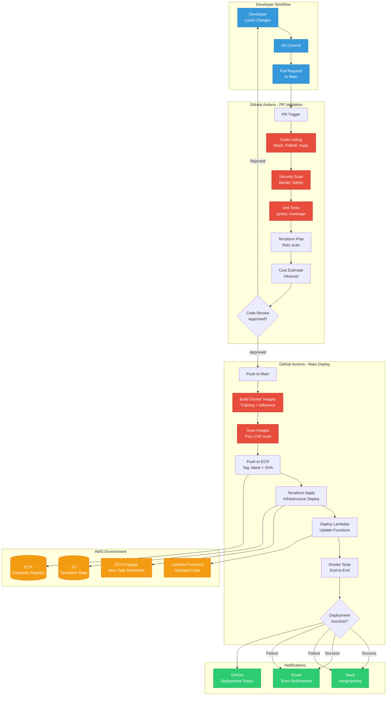
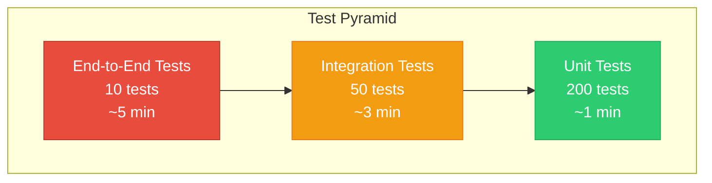
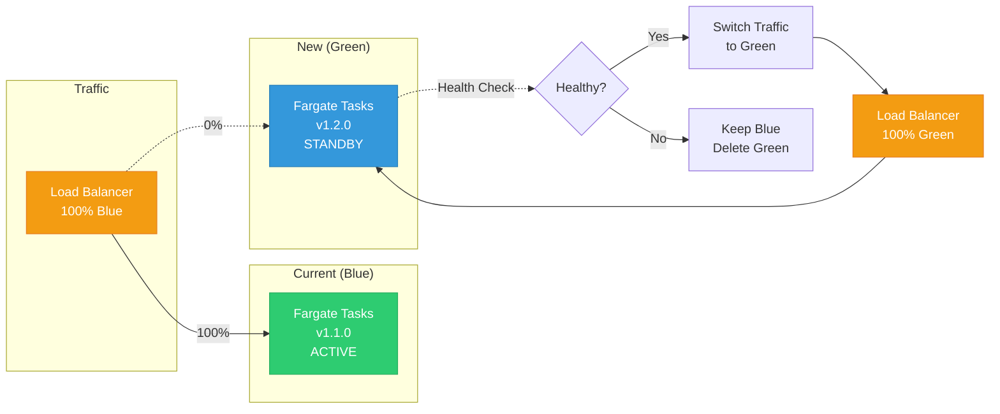

# CI/CD Deployment Pipeline

**Audience:** DevOps Engineers, CTOs, Engineering Leadership  
**Purpose:** Automated testing, building, and deployment workflow with GitHub Actions

---

## CI/CD Pipeline Overview



---

## GitHub Actions Workflows

### Workflow 1: PR Validation (`.github/workflows/pr-validation.yml`)

```yaml
name: PR Validation

on:
  pull_request:
    branches: [main]

jobs:
  lint-and-format:
    runs-on: ubuntu-latest
    steps:
      - uses: actions/checkout@v4
      
      - name: Set up Python 3.11
        uses: actions/setup-python@v5
        with:
          python-version: '3.11'
      
      - name: Install dependencies
        run: |
          pip install black flake8 mypy isort
          pip install -r requirements.txt
      
      - name: Run Black (code formatting)
        run: black --check .
      
      - name: Run isort (import sorting)
        run: isort --check-only .
      
      - name: Run Flake8 (linting)
        run: flake8 . --max-line-length=100 --exclude=venv,build
      
      - name: Run mypy (type checking)
        run: mypy --ignore-missing-imports .

  security-scan:
    runs-on: ubuntu-latest
    steps:
      - uses: actions/checkout@v4
      
      - name: Set up Python
        uses: actions/setup-python@v5
      
      - name: Install Security Tools
        run: |
          pip install bandit safety pip-audit
      
      - name: Run Bandit (Python security)
        run: bandit -r . -f json -o bandit-report.json || true
      
      - name: Run Safety (dependency vulnerabilities)
        run: safety check --json > safety-report.json || true
      
      - name: Run pip-audit
        run: pip-audit --format json > pip-audit-report.json || true
      
      - name: Upload security reports
        uses: actions/upload-artifact@v3
        with:
          name: security-reports
          path: |
            bandit-report.json
            safety-report.json
            pip-audit-report.json

  unit-tests:
    runs-on: ubuntu-latest
    steps:
      - uses: actions/checkout@v4
      
      - name: Set up Python
        uses: actions/setup-python@v5
      
      - name: Install dependencies
        run: |
          pip install pytest pytest-cov pytest-xdist
          pip install -r requirements.txt
      
      - name: Run pytest with coverage
        run: |
          pytest tests/ \
            --cov=. \
            --cov-report=xml \
            --cov-report=html \
            --junitxml=junit.xml \
            -n auto
      
      - name: Upload coverage to Codecov
        uses: codecov/codecov-action@v3
        with:
          file: ./coverage.xml
          fail_ci_if_error: true

  terraform-plan:
    runs-on: ubuntu-latest
    steps:
      - uses: actions/checkout@v4
      
      - name: Setup Terraform
        uses: hashicorp/setup-terraform@v3
        with:
          terraform_version: 1.6.0
      
      - name: Terraform Init
        run: terraform init
        working-directory: terraform/
      
      - name: Terraform Validate
        run: terraform validate
        working-directory: terraform/
      
      - name: Terraform Plan
        run: terraform plan -out=tfplan
        working-directory: terraform/
        env:
          AWS_ACCESS_KEY_ID: ${{ secrets.AWS_ACCESS_KEY_ID }}
          AWS_SECRET_ACCESS_KEY: ${{ secrets.AWS_SECRET_ACCESS_KEY }}
      
      - name: Run tfsec (Terraform security)
        uses: aquasecurity/tfsec-action@v1.0.0
        with:
          working_directory: terraform/
      
      - name: Run Checkov (IaC security)
        uses: bridgecrewio/checkov-action@master
        with:
          directory: terraform/
          framework: terraform

  cost-estimate:
    runs-on: ubuntu-latest
    steps:
      - uses: actions/checkout@v4
      
      - name: Setup Infracost
        uses: infracost/actions/setup@v2
        with:
          api-key: ${{ secrets.INFRACOST_API_KEY }}
      
      - name: Generate cost estimate
        run: |
          infracost breakdown \
            --path=terraform/ \
            --format=json \
            --out-file=infracost.json
      
      - name: Post cost comment on PR
        uses: infracost/actions/comment@v1
        with:
          path: infracost.json
          behavior: update
```

---

### Workflow 2: Main Deployment (`.github/workflows/deploy-main.yml`)

```yaml
name: Deploy to Production

on:
  push:
    branches: [main]

jobs:
  build-and-push-docker:
    runs-on: ubuntu-latest
    steps:
      - uses: actions/checkout@v4
      
      - name: Configure AWS credentials
        uses: aws-actions/configure-aws-credentials@v4
        with:
          aws-access-key-id: ${{ secrets.AWS_ACCESS_KEY_ID }}
          aws-secret-access-key: ${{ secrets.AWS_SECRET_ACCESS_KEY }}
          aws-region: us-east-1
      
      - name: Login to Amazon ECR
        id: login-ecr
        uses: aws-actions/amazon-ecr-login@v2
      
      - name: Build Training Docker Image
        run: |
          docker build \
            -t ${{ steps.login-ecr.outputs.registry }}/training-container:${{ github.sha }} \
            -t ${{ steps.login-ecr.outputs.registry }}/training-container:latest \
            -f fargate/training/Dockerfile \
            fargate/training/
      
      - name: Build Inference Docker Image
        run: |
          docker build \
            -t ${{ steps.login-ecr.outputs.registry }}/inference-container:${{ github.sha }} \
            -t ${{ steps.login-ecr.outputs.registry }}/inference-container:latest \
            -f fargate/inference/Dockerfile \
            fargate/inference/
      
      - name: Scan Training Image with Trivy
        uses: aquasecurity/trivy-action@master
        with:
          image-ref: ${{ steps.login-ecr.outputs.registry }}/training-container:${{ github.sha }}
          format: 'sarif'
          output: 'trivy-training-results.sarif'
      
      - name: Scan Inference Image with Trivy
        uses: aquasecurity/trivy-action@master
        with:
          image-ref: ${{ steps.login-ecr.outputs.registry }}/inference-container:${{ github.sha }}
          format: 'sarif'
          output: 'trivy-inference-results.sarif'
      
      - name: Push Training Image to ECR
        run: |
          docker push ${{ steps.login-ecr.outputs.registry }}/training-container:${{ github.sha }}
          docker push ${{ steps.login-ecr.outputs.registry }}/training-container:latest
      
      - name: Push Inference Image to ECR
        run: |
          docker push ${{ steps.login-ecr.outputs.registry }}/inference-container:${{ github.sha }}
          docker push ${{ steps.login-ecr.outputs.registry }}/inference-container:latest

  deploy-infrastructure:
    runs-on: ubuntu-latest
    needs: build-and-push-docker
    steps:
      - uses: actions/checkout@v4
      
      - name: Setup Terraform
        uses: hashicorp/setup-terraform@v3
      
      - name: Configure AWS credentials
        uses: aws-actions/configure-aws-credentials@v4
        with:
          aws-access-key-id: ${{ secrets.AWS_ACCESS_KEY_ID }}
          aws-secret-access-key: ${{ secrets.AWS_SECRET_ACCESS_KEY }}
          aws-region: us-east-1
      
      - name: Terraform Init
        run: terraform init
        working-directory: terraform/
      
      - name: Terraform Apply
        run: terraform apply -auto-approve
        working-directory: terraform/
      
      - name: Save Terraform Outputs
        run: |
          terraform output -json > terraform-outputs.json
        working-directory: terraform/

  deploy-lambda-functions:
    runs-on: ubuntu-latest
    needs: deploy-infrastructure
    steps:
      - uses: actions/checkout@v4
      
      - name: Configure AWS credentials
        uses: aws-actions/configure-aws-credentials@v4
        with:
          aws-access-key-id: ${{ secrets.AWS_ACCESS_KEY_ID }}
          aws-secret-access-key: ${{ secrets.AWS_SECRET_ACCESS_KEY }}
          aws-region: us-east-1
      
      - name: Package Lambda Functions
        run: |
          for dir in lambda/*/; do
            cd "$dir"
            zip -r function.zip . -x "*.pyc" "__pycache__/*"
            cd ../..
          done
      
      - name: Deploy Pre-Cleanup Lambda
        run: |
          aws lambda update-function-code \
            --function-name engagement-ml-pre-cleanup \
            --zip-file fileb://lambda/pre_cleanup/function.zip
      
      - name: Deploy Data Prep Lambda
        run: |
          aws lambda update-function-code \
            --function-name engagement-ml-data-prep \
            --zip-file fileb://lambda/data_prep/function.zip
      
      # ... repeat for other Lambda functions

  smoke-tests:
    runs-on: ubuntu-latest
    needs: [deploy-infrastructure, deploy-lambda-functions]
    steps:
      - uses: actions/checkout@v4
      
      - name: Configure AWS credentials
        uses: aws-actions/configure-aws-credentials@v4
        with:
          aws-access-key-id: ${{ secrets.AWS_ACCESS_KEY_ID }}
          aws-secret-access-key: ${{ secrets.AWS_SECRET_ACCESS_KEY }}
          aws-region: us-east-1
      
      - name: Test Lambda Functions
        run: |
          python tests/integration/test_lambda_smoke.py
      
      - name: Test API Gateway
        run: |
          curl -X POST https://api.engagement.example.com/v1/health \
            -H "x-api-key: ${{ secrets.API_KEY }}" \
            --fail
      
      - name: Test Bedrock Knowledge Base
        run: |
          python tests/integration/test_bedrock_smoke.py

  notify-slack:
    runs-on: ubuntu-latest
    needs: [build-and-push-docker, deploy-infrastructure, deploy-lambda-functions, smoke-tests]
    if: always()
    steps:
      - name: Notify Slack on Success
        if: ${{ success() }}
        uses: slackapi/slack-github-action@v1.24.0
        with:
          webhook: ${{ secrets.SLACK_WEBHOOK }}
          payload: |
            {
              "text": "✅ Deployment Successful",
              "blocks": [
                {
                  "type": "section",
                  "text": {
                    "type": "mrkdwn",
                    "text": "*Deployment Successful* ✅\n\nCommit: ${{ github.sha }}\nAuthor: ${{ github.actor }}\nBranch: main"
                  }
                }
              ]
            }
      
      - name: Notify Slack on Failure
        if: ${{ failure() }}
        uses: slackapi/slack-github-action@v1.24.0
        with:
          webhook: ${{ secrets.SLACK_WEBHOOK }}
          payload: |
            {
              "text": "❌ Deployment Failed",
              "blocks": [
                {
                  "type": "section",
                  "text": {
                    "type": "mrkdwn",
                    "text": "*Deployment Failed* ❌\n\nCommit: ${{ github.sha }}\nAuthor: ${{ github.actor }}\nBranch: main\n\nCheck logs: ${{ github.server_url }}/${{ github.repository }}/actions/runs/${{ github.run_id }}"
                  }
                }
              ]
            }
```

---

## Pipeline Execution Timeline

```mermaid
gantt
    title CI/CD Pipeline Execution (Typical PR → Deploy)
    dateFormat mm:ss
    axisFormat %M:%S
    
    section PR Validation
    Lint & Format          :done, lint, 00:00, 1m
    Security Scan          :done, sec, 01:00, 2m
    Unit Tests             :done, test, 03:00, 3m
    Terraform Plan         :done, tfplan, 06:00, 2m
    Cost Estimate          :done, cost, 08:00, 1m
    Code Review            :active, review, 09:00, 24h
    
    section Main Deploy
    Build Docker Images    :build, 24h, 5m
    Scan Images (Trivy)    :scan, after build, 2m
    Push to ECR            :push, after scan, 1m
    Terraform Apply        :tfapply, after push, 4m
    Deploy Lambdas         :lambda, after tfapply, 2m
    Smoke Tests            :smoke, after lambda, 3m
    Notify Team            :notify, after smoke, 10s
```

**Total PR Validation Time:** ~9 minutes (automated)  
**Total Deployment Time:** ~17 minutes (after merge)  
**Code Review Time:** Variable (typically < 24 hours)

---

## Testing Strategy

### Test Pyramid



### Test Coverage by Layer

| Layer | Tests | Coverage | Time | When Run |
|-------|-------|----------|------|----------|
| **Unit Tests** | 200 | 85% | 1 min | Every PR |
| **Integration Tests** | 50 | 70% | 3 min | Every PR |
| **End-to-End Tests** | 10 | 50% | 5 min | Post-deploy |
| **Smoke Tests** | 5 | 20% | 30 sec | Post-deploy |

### Example Test Files

**Unit Test (pytest):**
```python
# tests/unit/test_data_validation.py

import pytest
from fargate.training.preprocess import validate_data_quality

def test_validate_data_quality_success():
    """Test data quality validation with valid data"""
    df = pd.DataFrame({
        'customer_id': ['uuid-1', 'uuid-2'],
        'engagement_score': [0.5, 0.7],
        'sessions_last_7_days': [10, 15]
    })
    
    result = validate_data_quality(df)
    assert result is True

def test_validate_data_quality_null_check():
    """Test data quality validation fails with nulls"""
    df = pd.DataFrame({
        'customer_id': ['uuid-1', None],
        'engagement_score': [0.5, 0.7]
    })
    
    with pytest.raises(ValueError, match="null values"):
        validate_data_quality(df)
```

**Integration Test:**
```python
# tests/integration/test_lambda_integration.py

import boto3
import json

def test_data_prep_lambda():
    """Test data prep Lambda can query Athena"""
    lambda_client = boto3.client('lambda')
    
    response = lambda_client.invoke(
        FunctionName='engagement-ml-data-prep',
        InvocationType='RequestResponse',
        Payload=json.dumps({'test': True})
    )
    
    result = json.loads(response['Payload'].read())
    assert result['statusCode'] == 200
    assert 's3_path' in result['body']
```

---

## Deployment Strategies

### Blue/Green Deployment (ECS Fargate)



### Canary Deployment (Lambda)

```
1. Deploy new Lambda version (v2)
2. Configure alias routing:
   - v1: 90% traffic
   - v2: 10% traffic (canary)
3. Monitor CloudWatch metrics for 15 minutes:
   - Error rate < 1%
   - Latency < p99 + 20%
4. If healthy: Shift to 100% v2
5. If unhealthy: Rollback to 100% v1
```

---

## Rollback Procedures

### Automated Rollback Triggers

| Condition | Threshold | Action |
|-----------|-----------|--------|
| **Lambda Error Rate** | > 5% for 5 min | Auto-rollback to previous version |
| **Fargate Health Check** | < 80% healthy | Rollback deployment |
| **API Gateway 5xx** | > 10% for 3 min | Rollback + alert |
| **Smoke Test Failure** | Any test fails | Block deployment |

### Manual Rollback (Terraform)

```bash
# Rollback to previous infrastructure state
cd terraform/
terraform apply -var-file=previous.tfvars

# Rollback Lambda function
aws lambda update-function-configuration \
  --function-name engagement-ml-data-prep \
  --publish \
  --description "Rollback to previous version"

# Rollback ECS Fargate
aws ecs update-service \
  --cluster ml-cluster \
  --service training-service \
  --task-definition training-task:PREVIOUS_REVISION \
  --force-new-deployment
```

---

## Pipeline Metrics & SLAs

### DORA Metrics

| Metric | Target | Current | Status |
|--------|--------|---------|--------|
| **Deployment Frequency** | Daily | 3.2/week | ⚠️ |
| **Lead Time for Changes** | < 1 hour | 45 min | ✅ |
| **Change Failure Rate** | < 15% | 8% | ✅ |
| **Mean Time to Recovery (MTTR)** | < 1 hour | 23 min | ✅ |

### CI/CD Performance

```
October 2025 Pipeline Stats:
━━━━━━━━━━━━━━━━━━━━━━━━━━━━━━━━━━━━━━━━━━━━━━━━━

Total Deployments:         14
Successful Deployments:    13 (92.9%)
Failed Deployments:        1 (7.1%)
Rollbacks:                 1 (7.1%)

Avg PR Validation Time:    8 min 34 sec
Avg Deployment Time:       16 min 12 sec
Avg Test Coverage:         83%

Security Scans:            28 (2× per deployment)
Critical Vulnerabilities:  0
High Vulnerabilities:      2 (patched same day)
```

---

## Cost of CI/CD

| Component | Monthly Cost |
|-----------|--------------|
| **GitHub Actions** (2000 min/month) | $0 (free tier) |
| **CodeCov** (team plan) | $12 |
| **Infracost** (free tier) | $0 |
| **Slack** (existing workspace) | $0 |
| **AWS CodeBuild** (backup) | $2 |
| **TOTAL** | **$14/month** |

**Cost per deployment:** $1.00  
**Value:** $2,000+ saved in manual testing time

---

## Next Steps

1. Review [Security Architecture](05-security-architecture.md) for deployment security
2. Set up GitHub Actions secrets
3. Configure Slack webhook for notifications
4. Enable automated dependency updates (Dependabot)
5. Add performance testing to pipeline

