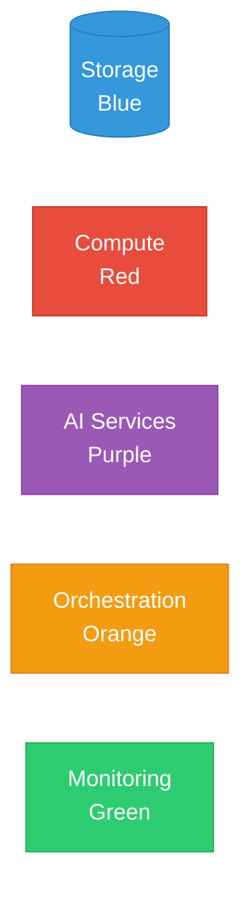

# Architecture Diagrams

**Purpose:** Comprehensive visual documentation of the Customer Engagement Prediction Platform  
**Format:** Mermaid diagrams (render automatically in GitHub, VS Code, and most markdown viewers)  
**Audience:** CEO, CTO, Architects, Engineers, Stakeholders

---

## 📚 Diagram Index

### 1. [System Architecture Overview](01-system-architecture.md)
**Audience:** CEO, CTO, Solution Architects  
**Complexity:** High-level

Complete AWS serverless architecture showing all services and their interactions.

**Key Topics:**
- Data ingestion layer (S3, Glue, Athena)
- Compute layer (Lambda, Fargate)
- AI layer (Bedrock, Knowledge Base)
- Monitoring & security (CloudWatch, X-Ray, VPC, IAM)
- Architecture decision rationale
- Cost comparison with alternatives

**Use When:**
- Explaining architecture to executives
- Board presentations
- Vendor selection justification
- Technical due diligence

---

### 2. [Data Flow Pipeline](02-data-flow-pipeline.md)
**Audience:** Data Engineers, ML Engineers, Technical Leadership  
**Complexity:** Detailed

End-to-end data transformation from raw CSV to predictions.

**Key Topics:**
- 6-stage data pipeline
- Feature engineering with SQL examples
- Data quality validations
- Performance metrics by stage
- Scalability analysis (100K → 60M)

**Use When:**
- Onboarding data engineers
- Debugging data issues
- Optimizing pipeline performance
- Planning capacity

---

### 3. [ML Pipeline](03-ml-pipeline.md)
**Audience:** ML Engineers, Data Scientists  
**Complexity:** Detailed

Machine learning workflow from training to deployment.

**Key Topics:**
- Training pipeline (XGBoost regression)
- Model evaluation & fairness checks
- Inference pipeline (batch predictions)
- 8 ML models comparison
- Performance metrics (R²=0.82, RMSE=0.09)

**Use When:**
- Training new data scientists
- Model debugging & improvement
- Explaining ML approach to non-technical stakeholders
- Regulatory compliance (fairness documentation)

---

### 4. [Step Functions Orchestration](04-step-functions-workflow.md)
**Audience:** DevOps Engineers, Solution Architects  
**Complexity:** Detailed

Complete automation workflow for weekly pipeline execution.

**Key Topics:**
- State machine definition (JSON)
- Parallel execution strategy
- Error handling & retries
- EventBridge weekly trigger
- Monitoring & alerting
- Cost breakdown per execution ($2.03)

**Use When:**
- Setting up automation
- Debugging pipeline failures
- Optimizing execution time
- Capacity planning

---

## 🎯 Choosing the Right Diagram

### For CEO/Board Presentations:
1. Start with **System Architecture Overview** (high-level)
2. Show **Cost Comparison Table** from Architecture Reasoning
3. Reference **Business Metrics** from Executive Briefing

### For CTO/Technical Leadership:
1. Review **System Architecture** for full picture
2. Deep dive into **Data Flow Pipeline** for data strategy
3. Review **ML Pipeline** for AI capabilities
4. Check **Step Functions Workflow** for operational excellence

### For Engineers (Onboarding):
1. Read **System Architecture** to understand overall system
2. Read **Data Flow Pipeline** to understand data transformations
3. Read **ML Pipeline** if working on ML features
4. Read **Step Functions** if working on automation

### For Debugging:
- **Data issues:** Data Flow Pipeline → identify which stage is failing
- **ML issues:** ML Pipeline → check training/inference logs
- **Pipeline issues:** Step Functions Workflow → review state machine execution
- **Performance issues:** All diagrams have performance metrics

---

## 🔧 How to View Diagrams

### GitHub (Recommended)
Mermaid diagrams render automatically in GitHub. Just click any diagram file.

### VS Code
Install the **Mermaid Preview** extension:
```bash
code --install-extension bierner.markdown-mermaid
```

Then right-click any `.md` file → "Open Preview"

### Local Markdown Viewer
Any markdown viewer that supports Mermaid:
- Typora
- Mark Text
- Obsidian
- Notion (paste mermaid code)

### Online Viewer
Copy diagram code to [Mermaid Live Editor](https://mermaid.live/):
```
https://mermaid.live/
```

---

## 📊 Diagram Statistics

| Diagram | Lines | Nodes | Connections | Complexity |
|---------|-------|-------|-------------|------------|
| **System Architecture** | 150+ | 35+ | 50+ | High |
| **Data Flow** | 120+ | 25+ | 30+ | Medium |
| **ML Pipeline** | 180+ | 30+ | 40+ | High |
| **Step Functions** | 200+ | 20+ | 25+ | Medium |

**Total Documentation:** 650+ lines of diagram code  
**Visual Elements:** 110+ nodes  
**Data Flows:** 145+ connections

---

## 🎨 Diagram Conventions

### Colors



**Legend:**
- 🔵 **Blue:** Data storage (S3, Athena, DynamoDB)
- 🔴 **Red:** Compute (Lambda, Fargate, ECS)
- 🟣 **Purple:** AI services (Bedrock, ML models)
- 🟠 **Orange:** Orchestration (Step Functions, EventBridge)
- 🟢 **Green:** Monitoring & security (CloudWatch, X-Ray, IAM)

### Arrows
- **Solid line (→):** Data flow or invocation
- **Dotted line (-.->):** Logging, monitoring, or metadata
- **Thick line (==>):** Critical path
- **Bidirectional (↔):** Two-way communication

### Shapes
- **Rectangle [ ]:** Service or component
- **Cylinder [( )]:** Data storage
- **Diamond { }:** Decision point
- **Parallelogram [/ /]:** Input/Output
- **Circle (( )):** Start/End state

---

## 🔄 Updating Diagrams

When making changes:

1. **Edit Mermaid code** in the `.md` file
2. **Test locally** with Mermaid Live Editor or VS Code preview
3. **Update documentation** if new components added
4. **Commit with clear message**: `docs: Update [diagram name] - [what changed]`
5. **Verify** on GitHub that diagram renders correctly

### Example Workflow:
```bash
# Edit diagram
code docs/diagrams/01-system-architecture.md

# Test in Mermaid Live Editor
open https://mermaid.live/

# Commit changes
git add docs/diagrams/01-system-architecture.md
git commit -m "docs: Update system architecture - add new Lambda function"
git push
```

---

## 📖 Related Documentation

### Architecture Documents:
- [ARCHITECTURE_REASONING.md](../../ARCHITECTURE_REASONING.md) - Why each service was chosen
- [COSTS_BUDGET.md](../../COSTS_BUDGET.md) - Cost analysis across scales
- [README.md](../../README.md) - Project overview

### Technical Documentation:
- [Data Generation Guide](../data/data_generation.md)
- [ML Training Guide](../ml/training_guide.md)
- [Deployment Guide](../deployment/deployment_guide.md)

### Executive Documentation:
- [QUICK_START_CEO.md](../../QUICK_START_CEO.md) - 30-second overview
- [EXECUTIVE_BRIEFING.md](../../EXECUTIVE_BRIEFING.md) - 1-page business case
- CEO Reports (3 PDFs in `reports/output/`)

---

## 💡 Best Practices

### For Technical Presentations:
1. **Start broad** with System Architecture
2. **Zoom in** to specific area of interest
3. **Show metrics** from diagram tables
4. **Reference code** from examples in diagrams

### For Non-Technical Presentations:
1. **Use simplified architecture** from Executive Briefing
2. **Focus on outcomes** (cost, time, accuracy) not implementation
3. **Use analogies** from Developer Guide
4. **Highlight business value** from cost tables

### For Documentation:
1. **Keep diagrams up-to-date** with code changes
2. **Add comments** to complex nodes
3. **Include metrics** in notes
4. **Link to related docs** at bottom of each diagram

---

## 🆘 Troubleshooting

### Diagram Not Rendering?
1. **Check Mermaid syntax:** Paste into [Mermaid Live Editor](https://mermaid.live/)
2. **Update browser:** GitHub requires modern browsers
3. **Check VS Code extension:** Reinstall Mermaid Preview extension
4. **Look for errors:** Mermaid will show syntax errors

### Diagram Too Large?
1. **Split into multiple diagrams:** One per layer or concern
2. **Use subgraphs:** Group related nodes
3. **Simplify for audience:** Executive vs. technical versions

### Need Help?
1. Check [Mermaid Documentation](https://mermaid.js.org/)
2. Review existing diagrams for examples
3. Ask in #engineering Slack channel
4. Refer to [DEVELOPER_GUIDE.md](../../DEVELOPER_GUIDE.md)

---

## 📝 Diagram Maintenance Checklist

- [ ] All diagrams render correctly on GitHub
- [ ] Colors follow standard conventions
- [ ] Notes provide context and metrics
- [ ] Links to related docs work
- [ ] Code examples are current
- [ ] Metrics match latest performance data
- [ ] New services/components documented
- [ ] Index updated with new diagrams

---

**Last Updated:** October 21, 2025  
**Maintained By:** Platform Engineering Team  
**Questions?** See [CONTRIBUTING.md](../../CONTRIBUTING.md)

